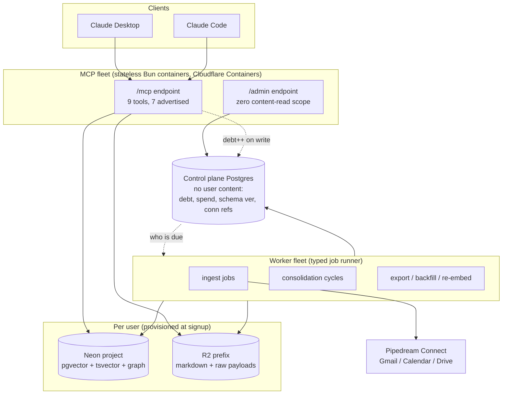
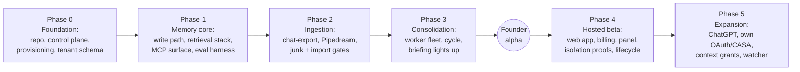

# brainz v1 Roadmap - Plan

**Target repo:** `~/code/brainz` (this repo; not yet git-initialized — U1 creates it). All paths are brainz-relative. Paths prefixed `gbrain:` refer to the reference repo at `~/code/gbrain`, which is reference-only — never a dependency.

---

## Goal Capsule

- **Objective:** Build brainz from empty repo to a founder-alpha personal AI brain (Phases 0–3), then to a hosted consumer beta (Phase 4) and expansion (Phase 5). The alpha bar: the founder's real Gmail/Calendar/Drive data flows in via Pipedream, and recall/briefing from Claude Desktop and Claude Code meet the gbrain-derived accuracy floors.
- **Authority hierarchy:** This plan > the ideation doc (`docs/ideation/2026-08-11-consumer-grade-brain-ideation.html`) > the research corpus (`docs/research/`). Where this plan resolves a contradiction the ideation doc left open, this plan wins; the Gap Register records each such resolution.
- **Grounding baseline (standing instruction):** gbrain's capability inventory is the requirements baseline. The 131-capability parity audit (`docs/research/2026-08-11-capability-parity.md`) and its accuracy-stack table govern what "parity" means. Every phase traces to it; no audited critical capability may be silently dropped (R7).
- **Stop conditions:** Stop and surface — do not guess — if: (a) Neon cannot commit in writing to >30k projects on non-punitive terms (asked in Phase 0, gates Phase 4) — evaluate that answer against **both** consequences, since KTD1's fallback costs more than an isolation downgrade: schema-per-tenant means a compute cannot suspend while any co-tenant is active, which invalidates R13's $0.105/month idle anchor and the free tier's whole margin model; (b) Pipedream Connect cannot confirm production use of their OAuth apps for Gmail restricted scopes (asked in Phase 0 — see Assumption 1); (c) the deterministic eval tier cannot reach the R6 floors after U5+U7 tuning **and** both of U7's calibration receipts are in hand — only then is a floor miss an accuracy-architecture problem rather than a fixture-calibration one; ~~(d) a Cloudflare Container cannot open raw outbound TCP to Neon (Assumption 4)~~ — **resolved 2026-08-12: it can.** This stop condition is retired; KTD2 needs no re-decision before U6. It becomes a *re-check* rather than a gate, per Assumption 4's standing caveat.
- **Phase 0 cheap-check tasks (founder-owned, parallel to U1):** **two of the six are now done.** ✅ Assumption 4 settled 2026-08-12 (raw TCP works from a deployed Container — KTD2 stands). ✅ R9's storage boundary settled 2026-08-12 (prefix-scoped credentials enforce it; bucket-quota question retired). Still open: get the Pipedream and Workers-AI-rate-limit answers in writing (drafts in `docs/vendor/`); run one real client scheduled task against an MCP connector tool to settle Assumption 3; and check whether remote MCP connectors surface on claude.ai web and mobile, which sets the beta funnel U15 designs for. Each costs effectively nothing and each can invalidate a load-bearing decision; running them after Phases 0–3 would strand real work. Four need no vendor at all — a stub tool, a throwaway container, an R2 API call and a test account answer them today — and the scheduled-task failure mode is a *different product* ("ask for a briefing" rather than "wake up to one"), which is a Phase 0 decision, not a Phase 3 discovery.
- **Execution profile:** Phases 0–3 units are implementation-grade. Phase 4–5 units are milestone-grade and carry `Execution note: re-plan before execution` — split them with a follow-up `ce-plan` pass when their phase starts.
- **Tail ownership:** Each unit lands as its own commit(s) in the brainz repo; the repo is public from U1, so commit hygiene and the no-secrets rule apply from the first commit.

---

## Product Contract

### Summary

Plan the v1 build of brainz: a consumer-grade personal AI brain on one Neon Postgres project per user plus R2 file storage, consumed only over stateless MCP, with Pipedream-vendored connectors from the alpha, consolidation as the only place unbounded model spend happens, gbrain-derived accuracy floors enforced in CI, and the server core developed AGPL-3.0 in the open from the first commit.

### Problem Frame

gbrain proves the product value — a personal knowledge brain with hybrid retrieval, entity knowledge, and background consolidation — but is operable only by technical users: CLI install, git-repo sources, hand-installed daemons, BYO keys, no OAuth connectors. This session produced a full design (9 ranked ideas, a cross-cutting principle, 13 parity cards) and a capability audit whose verdict was that the design matches what gbrain *is* but not yet what gbrain *does at the moment of answering*: answer quality lives in a ~19-stage post-retrieval stack, an instruction layer that makes agents use the brain, and a measurement apparatus — most of which the ideation cards did not commit to. This plan sequences all of it into buildable phases, resolves the contradictions the audits surfaced, and adds the pieces every audit left unowned (account identity, billing, fleet hosting, licensing).

### Requirements

**Product identity**

- R1. A non-technical user reaches a working brain with only account signup and OAuth consent — no CLI, no keys, no setup questions.
- R2. Brain knowledge is consumed only over stateless MCP (2026-07-28 spec). v1 clients: Claude Desktop and Claude Code. ChatGPT joins in Phase 5.
- R2a. Getting brainz into a user's Claude is an owned product step, not an instruction: the web app serves a guided connect flow post-signup, and that flow names a concrete mechanism rather than a prohibition — "paste this URL into settings" is the setup question R1 forbids, so U15 must state what replaces it and verify it against the target clients' actual custom-connector UX before building. **The activation moment precedes OAuth, not follows it** (owned by U6): a new user's first act is a `remember` from inside their client answered by a `recall`, with connectors surfaced afterward through the envelope's `setup` field. A mailbox grant is a reasonable ask once the loop has been felt and a large one before it, so R1's minimum path is signup-to-first-memory; OAuth consent is the second step, not part of the first. And **any row whose `origin_context` union includes an external origin** — ingested payloads *and* the model-derived entity cards, commitments, and canonical summary chunks descended from them — is returned to agents inside an untrusted-data demarcation, so a mailbox cannot issue instructions to the user's assistant by laundering them through consolidation.
- R3. Ingest, processing, and consolidation run without user operation once a source is connected.
- R4. The server ships the instructions that make connected agents capture to and consult the brain (MCP server `instructions` + tool descriptions + response envelope), versioned as a dated release asset.

**Accuracy parity (gbrain-grounded)**

- R5. Retrieval implements the post-retrieval accuracy stack at parity with the audit's table: shared normalizer (write+read), intent classification as ranking input, three recall arms (vector, FTS, graph) with RRF, alias hop, title-phrase boost, per-prefix recency decay, source-type priors, 4-layer read-time dedup, token-budget packing, bounded cross-encoder rerank, autocut on rerank score.
- R6. Measurement floors adopted from gbrain, enforced by tier. **Blocking tier (CI, every PR):** nDCG@10 ≥ 0.65 absolute; title-substring Hit@1 ≥ 0.95; alias Hit@1 ≥ 0.98; dilution Hit@3 = 1.0; deterministic-extraction recall ≥ 0.8 with non-zero exit; per-question-type floors (relational, named-entity, temporal, context-fenced), never only an aggregate. **Nightly canary tier:** model-extraction recall ≥ 0.8, alerting on breach and gating the beta release — it cannot live in the blocking tier because that tier makes zero model calls. Floors are absolute only once U7's calibration baseline (R6a) establishes the fixture corpus is neither trivial nor unattainable.
- R6a. The fixture corpus carries **two** committed calibration receipts, because one proves only half of what stop condition (c) leans on. **Lower bound:** a naive single-arm baseline scores below each ranking floor by a committed numeric margin, so a pass proves the stack rather than an easy corpus. **Upper bound (attainability):** the gold answer key scored through the same metric implementation, plus a hand-audited answerability sample per question type, so a miss cannot be misread as an architecture failure on a corpus that was simply harder than gbrain's. Both receipts scope to the ranking floors (nDCG@10, title-substring, alias, dilution, per-question-type); the deterministic-extraction floor records a rule-coverage baseline instead, since a retrieval baseline produces no comparable score.
- R7. Capability-audit traceability: every capability the parity audit marks critical is `covered`, `deferred(revisit_by)`, or `dropped(reason)` in `upstream/concepts.jsonl` — never silently absent.
- R8. Consolidation runs a phased cycle (deterministic first, model phases second, materialization last) producing entity cards, salience, a canonical summary chunk, extracted commitments, and a contradiction report. Free tier runs the deterministic phases only — so a free-tier briefing carries retrieval plus deterministic outputs (recent changes, staleness, dedup-clean results) and explicitly **not** participant cards, extracted commitments, or the synopsis layer. The free briefing names what the paid tier would add rather than being silently thinner, and its upgrade prompt reads the deterministic `pending_debt` counter (items awaiting extraction and contradiction checks) — never a contradiction count, which is a paid artifact the free tier by construction cannot see.
- R8a. Chat-export and folder import (U8) are ingestion paths the free tier always includes. They carry no per-user *connector* vendor fee, so the free tier has a defined non-empty job regardless of how the open connector-inclusion question lands — but they are **not free**: every imported chunk is a metered embedding call, and KTD8 prices a 50k-chunk first import at ~$2.60, roughly 25× R13's idle anchor. R14's first-import gate therefore belongs on **this** path too, not only on U9's connector pulls: U8 ships first and is the one path the free tier guarantees, so shipping it ungated would put the largest uncapped spend behind the tier with no billing relationship.

**Isolation and trust**

- R9. One Neon project (one branch, one database, one role) per user — structural isolation, verifiable by connection string. File storage is **platform-enforced, conditional on correct prefix derivation** — settled 2026-08-12, receipt at `scripts/probes/r2-boundary/RESULT.md`. Each tenant's request path holds a short-TTL **prefix-scoped R2 temporary credential** minted from a parent token; a credential scoped to one tenant met an attributable `403` on every cross-tenant read, write, delete, list and cross-bucket access, in both the API and local mint modes, with parent-side checks confirming no side effect. Bucket-per-tenant remains viable but unproven and is not needed — Option B requires no bucket-quota answer, which retires that question rather than answering it (no R2 API exposes the account quota; measured headroom was ≥148).

  **The conditional is load-bearing and is not a hedge.** R2 matches `prefixes` **literally**: in this run a credential scoped to `tenant-a` successfully read `tenant-abc/` and returned the sibling tenant's object. The platform enforces the string it was given, not a boundary at the separator — so tenant `alice` would read `alice2`'s files, silently, holding a credential Cloudflare considers correctly scoped. Every derived prefix must therefore terminate with `/`, one storage accessor still derives every key from authenticated tenant context, and no call site builds a key from request input. That accessor guard is a **required control, not defence in depth** (U2), and its test must assert the *sibling* case specifically — a test comparing only `tenant-a` against `tenant-b` passes while the real hazard is live. The control plane holds only ids, counters, timestamps, tier, and connection-string references.
- R10. A published machine-readable register names every component that touches more than one user's data — including the **parent** object-storage credential (R9; the request path itself now holds only a per-tenant credential with a bounded TTL, which is a real blast-radius reduction **only if the parent key is not resolvable by the request-path identity** — the same rule R11 applies to connection strings, now applying to a second store) and each platform-scoped credential the fleet holds (Neon org key, object-storage account credential, Pipedream project key, the hosted model-provider keys, and the **attestation signing key**, whose holder can forge an isolation receipt for any tenant), each with its blast radius and rotation owner. **It also names every party that user content is transmitted to**, which is a shorter list than the model catalog implies: KTD13 admits exactly two model-side processors (the embedding provider and the extraction/enrichment/contradiction provider) and keeps every other content-touching model op on Cloudflare's hosted plane — open weights on Cloudflare GPUs, no proxy to the model's originating lab. Adding a third-party model row is therefore a register change and a subprocessor-list change (U15), not just a config edit; the register is what makes that cost visible before it is paid. Per-tenant BYOK provider keys (R22) are tenant secrets rather than platform credentials, but they are named here so the distinction is explicit rather than assumed. Attestations verify against a published public key with a documented rotation and revocation procedure. **Naming the signing key's blast radius is not the same as containing it:** whoever can sign can forge a receipt for any tenant, so the private key lives outside the MCP fleet's readable secret scope — a KMS-held key or a sign-only signer endpoint bound to a fixed attestation payload shape, with no fleet container able to export it. The default of dropping it into the same request-path secret store the fleet reads would let one compromise of the process that parses attacker-controlled mail mint valid receipts for a system whose isolation is already gone, which inverts the control: the receipt keeps verifying after the property stops holding. A signed `brain`-tool attestation (plus `_meta` stamp) and a public canary tenant make isolation externally checkable; the attestation reports the Neon boundary as structural, and — per the settled R9 answer — reports the R2 boundary as **structural, scoped to the mint modes actually verified (api, local) and no wider**, carrying R9's prefix-derivation condition rather than claiming the platform enforces a separator it does not. **Cloudflare is itself the broadest >1-user component** — fleet host, container platform, and AI Gateway transport for every model call — and carries its own register entry rather than being treated as invisible substrate.
- R11. The web app's `/admin` credential has zero content-read scope, asserted by a CI case expecting `scope_denied` on `recall`. **The same boundary holds one layer down, where the tool surface cannot enforce it:** the secret store holds every tenant's connection string and bearer, and resolution bypasses tool dispatch entirely, so entries are namespaced per tenant and resolvable only by the fleet request-path identity serving that tenant's own authenticated bearer. The `/admin` and web-app identities hold no resolve permission on any tenant namespace — a `scope_denied` on `recall` proves nothing if the same credential can read the connection string and connect directly.
- R12. Model-derived knowledge carries a trust level; contradiction handling is report-only; automated mutation is confidence-gated (≥0.8 apply, 0.5–0.8 queue, <0.5 log); users get versions, soft-delete with TTL, blast-radius preview on destructive ops, and an erasure path spanning **five** stores — Neon, R2, the control plane, the connector vendor's stored OAuth tokens, and the tenant's stored BYOK provider key (R22). **Erasure has a second axis the five legs do not cover.** Every leg is keyed to the *tenant*; the brain also holds identifiable content about correspondents and meeting attendees who never signed up, and no mechanism deletes one third party's data from a brain that stays live. Beta therefore owes a controller/processor determination for non-user PII and a subject-scoped erasure path keyed on a correspondent identifier, spanning Neon rows, the derived entity cards and commitments built from them, R2 raw payloads, and the re-derivation that follows — built once at U17 rather than retrofitted across five stores after the first request arrives.
- R12a. Claims sourced from external content keep their extracted trust level and are excluded from the compiled-truth ranking boost until corroborated. **Corroboration means an origin the external sender cannot also write** — a user attestation or an internally-derived origin. **The attestation must be out-of-band.** A `remember` arriving over `/mcp` does not corroborate anything, because the assistant holding `remember` is the same assistant reading the attacker's mail: a crafted message can instruct the agent to restate its own claim and thereby promote itself into the compiled-truth boost and then the briefing. A restatement over MCP marks a claim *restated* and clears nothing; the review-queue entry closes only on an action taken in the web app or panel (U12/U14/U15), which the connected agent cannot issue. A mail message and the calendar event derived from it count as **one** origin, not two: every alpha source is writable by unauthenticated outsiders, so "two connected accounts agree" is forgeable by the sender who wrote both.

**Cost**

- R13. An idle user costs ≈ $0.105/month (storage only): computes suspend, nothing runs for inactive brains.
- R14. Every model call is metered through one gateway; a model absent from the canonical pricing table hard-fails when a cap is set; first import is gated with a bounded default window and a visible widen path; each tenant carries a rolling spend counter the scheduler reads.
- R22. Inference runs on **hosted keys by default, with bring-your-own-key as a first-class alternative**. Resolution order per call: an explicit per-call key → the tenant's stored provider key → the hosted pooled key. BYOK calls are still metered (for the user's own visibility and their spend cap) but do not count against hosted COGS. A stored provider key is a new secret class: it belongs in R10's register and in R12's erasure legs.

**Context**

- R15. Every row carries an immutable, credential-derived `origin_context`; an inferred, mutable `subject_context` is separate. Access fences evaluate origin only; inference may narrow results, never widen access; derived rows inherit the union of their inputs' origins.

**Ingestion**

- R16. Alpha connectors (Gmail, Calendar, Drive) authenticate through Pipedream Connect's OAuth apps; the substrate keeps a per-item ingest log, preserves raw payloads, applies a junk gate before embedding, and pulls idempotently on a per-source cadence.
- R17. Bulk chat-export import (Claude and ChatGPT export formats) is a supported ingestion path.
- R23. Images and PDFs that reach the brain become searchable text. Transcription is a model call and therefore a consolidation phase, never the write path (per the cross-cutting principle); the original is preserved as a raw payload so a better extractor can re-derive later.

**Durability and openness**

- R18. Export produces slug-nested markdown identical to the self-host input format; the index is rebuilt from files, not backed up; scheduled self-export to a user-owned destination exists. Model-derived artifacts (entity cards, salience, commitments) are **re-derived on import at re-consolidation cost**, not carried in the export. The CI round-trip test therefore pins knowledge parity, not only file parity: it runs the blocking eval against the re-imported tenant.
- R19. The server core is AGPL-3.0 in a public repo from the first commit; hosted-only configuration and secrets stay outside the repo.
- R20. Upstream discipline per the extract/watch/re-implement design: gbrain's wire conformance runner runs against brainz in CI (declared `memory-verbs-v1-partial`), the concepts ledger fails CI on unclassified entries and passed revisit dates, and gbrain hazards ship as guards or skipped tests with reason strings.

**Recipes**

- R21. Documented recipes let a user set up a daily briefing and similar routines using their client's scheduled-task feature pulling the `briefing` tool — recipes are docs + prompts, not a server-side scheduler.

### Key Decisions (product level)

- Founder-alpha before hosted beta, with Pipedream connectors in the alpha (session-settled: user-directed — chosen over no-OAuth alpha and straight-to-beta: real data early without CASA on the critical path). Governs R1, R16.
- Claude-first launch (session-settled: user-directed — chosen over Claude+ChatGPT day one: OpenAI app review has no published SLA and must not gate v1). Governs R2.
- Server core open AGPL-3.0 from day one (session-settled: user-directed — chosen over protocol-only OSS and closed-first). Governs R19.
- Personal and work data in one store, marked by origin (session-settled: user-directed — chosen over per-connected-account databases: both contexts must join). Governs R15.
- gbrain is reference-only; improvements arrive by extract/watch/re-implement (session-settled: user-directed — chosen over running gbrain in a container: "too restricting"). Governs R20.

### Scope Boundaries

**Deferred for later (dated in the ledger, not dropped)**

- Gmail/Drive on our own OAuth apps + CASA certification — Phase 5 exit ramp from Pipedream (paperwork starts when beta planning starts).
- ChatGPT `/openai` endpoint, Apps SDK submission, ChatGPT Work enterprise claim flow — Phase 5.
- Image **embedding** arm — OCR-to-text ships in U21 instead, and KTD9 reserves the schema column so adopting the arm later is not a migration. Also: push delivery channels beyond client-pulled briefings, brain sharing/team brains, enterprise data residency/legal hold.
- Shared signed **public-entity authority file** (entity cards and aliases for public companies, so every brain does not re-derive the same facts about Stripe or GitHub while holdings stay per-user and never leave) — revisit at Phase 5 planning. This is the origin's only named compounding mechanism, and it survives here as a dated deferral rather than vanishing between documents: R7's ledger check covers parity-audit capabilities only, so an origin idea dropped without a date is reachable by no check at all. Known liabilities to weigh at revisit: one-way data flow, and ownership of maintenance and accuracy for facts brainz asserts on every user's behalf.

**Outside this product's identity (from the gbrain audit's out-of-scope table)**

- Code indexing (tree-sitter, call graphs, code tools), LLM multi-query expansion on the read path, user-visible chunker/search-mode pickers, multi-pack lenses and agent-authored schema evolution, brain-resident skillpacks and their supply chain, the 52-skill markdown router, operator SPA, composite `brain_score`.
- Branding/naming and marketing site content (the placeholder name "brainz" is not a commitment).

### Outstanding Questions

- **Blocking for Phase 4, asked in Phase 0:** Neon's ceiling and pricing above 30k projects, in writing. Owner: founder. The answer only gates Phase 4, but asking early costs one email and arrives before Phases 1–3 deepen the project-per-user investment.
- **Blocking for Phase 3, asked in Phase 0:** Workers AI per-model rate limits at fleet scale, and whether they are per-account or per-gateway. KTD13 routes every consolidation phase through Cloudflare-hosted models; the unified-billing changelog quotes 20 → 50 rpm per account per model on the frontier tier, and if the standard tier is bounded comparably, bulk consolidation across many tenants hits a throughput ceiling that has nothing to do with price. Owner: founder, same email as the Pipedream question. A low cap does not change the model picks — it changes whether U10's scheduler needs per-model queueing.
- ~~**Blocking for Phase 1:** does bucket-per-tenant or prefix-scoped R2 temporary credentials work at target scale?~~ **ANSWERED 2026-08-12** — prefix-scoped temporary credentials work and enforce the boundary; see R9 and `scripts/probes/r2-boundary/RESULT.md`. The bucket-quota question is **retired rather than answered**: Option B needs no quota, and no R2 API exposes one, so the 30k figure could only ever have come from Cloudflare in writing. What replaced it is a hard implementation constraint, not an open question — R2 matches prefixes literally, so U2's terminator guard is required.
- **Moved out of Deferred, asked in Phase 0:** do remote MCP connectors surface on claude.ai web and mobile? The plan already calls this "would widen the beta funnel materially," which makes it a funnel-shape question, not a nice-to-have: if the answer is no, the beta's reachable stranger is someone who already runs a desktop app or a developer CLI, and U15's guided connect flow is being designed against the wrong user. Same cheap-check logic as the scheduled-task probe — it costs one test account today and changes what U15 builds toward.
- **Owned at U15 re-plan:** does the free tier include OAuth connectors? Pipedream bills ~$2 per external user per month plus polling-driven embedding spend, so a connector-enabled free user costs roughly 20× R13's idle anchor before any model call. This is a unit-economics decision, not an engineering one.
- **Deferred:** Pipedream credit-pool overage pricing at scale (sales conversation before beta); whether MCP hosts forward `tools/call` for unadvertised names (decides `manage`'s advertisement; fallback in U14); whether OpenAI review accepts five tools beyond `search`/`fetch` on `/openai` (Phase 5; fallback: ride `fetch`'s id grammar); whether Pipedream proxies message bodies through its own infrastructure or brainz calls Google directly with a Pipedream-minted token (decides whether Pipedream's R10 entry reads "credential vendor" or "content processor" — a materially different disclosure on U15's subprocessor list); briefing push delivery beyond client pulls (revisit after alpha usage data); paid-tier price against per-user model spend (margin model before billing ships).

---

## Planning Contract

### Key Technical Decisions

- KTD1. **Substrate: Neon project-per-user + R2 + a content-free control-plane Postgres.** (session-settled: user-approved — chosen over Cloudflare D1/Vectorize/DO and Turso: the only candidate with structural isolation, $0-idle suspend, and pgvector+tsvector+recursive-CTE in one engine/one transaction.) A suspended project costs ~$0.105/mo; the connection string is the user-facing isolation receipt. Neon is structural isolation; object-storage prefixes are convention-enforced (R9) — the register says which is which. Alpha provisions synchronously, one tenant at a time; the warm pool of pre-provisioned projects is beta machinery (U15), sized by the create-to-first-query p99 U2 measures. **The no-branch is priced, not implied** (same standard as KTD8): if the Phase 0 Neon answer is punitive, the fallback tenancy model is schema-per-tenant inside pooled Neon projects. That forces U2/U3/U16 rework, and it **downgrades the product's central claim** — R9's structural isolation and R10's attestation both become convention-enforced, and the connection string stops being a user-facing receipt. **The larger half of the cost is economic, not architectural:** two of the three reasons this decision was made were structural isolation *and $0-idle suspend*, and schema-per-tenant loses both — a pooled compute cannot suspend while any co-tenant is active, so R13's $0.105/month idle anchor and the free tier's margin model go with it. A reader pricing the no-branch on isolation alone is pricing less than half of it. Knowing that cost in Phase 0 is the point of asking early.
- KTD2. **MCP and worker fleets: stateless Node/Bun containers on Cloudflare Containers. Not Workers, not Hyperdrive.** (session-settled: user-directed — Cloudflare is the deployment target; chosen over Railway.) The two rejections stand on their original evidence and are why this is Containers rather than Workers: Hyperdrive caps at **25 configs per account**, so a per-tenant-connection-string design walls at tenant #26, and Workers' **128 MB** ceiling rules out in-process rerank and embedding batches. Containers run arbitrary Docker images with per-10ms billing and scale-to-zero, so the fleet keeps pooled TCP, prepared statements, a per-tenant `postgres.js` connection LRU (~500 warm), and `SET LOCAL` discipline for GUCs — connecting directly to Neon, no Hyperdrive slot consumed. Consolidation cycles run minutes with embedding batches and belong on Containers regardless. Note that Containers are reached *through* a Worker (a Durable Object routes to instances) — the shape is Worker → Container, not one instead of the other. **Instance addressing is part of this decision, not an implementation detail:** the connection LRU only pays off under tenant affinity, so container instances are addressed by a Durable Object id derived from the tenant id. Route by load instead and every instance opens its own connections to the same Neon compute (amplification across the fleet) while most calls take a cold LRU miss — which lands directly on the warm-p99 promise this decision exists to defend. **The Assumption-4 no-branch keeps Containers.** If raw TCP is blocked, the first fallback is Containers plus `@neondatabase/serverless` over **WebSocket on 443** — a port Containers explicitly permit — whose `Pool`/`Client` preserve session and transaction semantics, so `SET LOCAL hnsw.ef_search`, prepared statements and the per-tenant LRU all survive. Only if WebSocket egress also fails does the branch fall to Workers plus the one-shot HTTP driver, which is where pooled TCP, prepared statements and the 128 MB headroom are genuinely forfeited. Conflating the WebSocket driver with the HTTP function is what made that pivot look forced.
  - **Cold-start cost, priced rather than assumed.** Containers trade start latency for capability, and it compounds with the substrate: a first call on a dormant tenant pays container cold start (~1–3 s for a Node image) **plus** the Neon wake (~500–870 ms). Several seconds on exactly the call an agent makes first. Acceptable — agent tool calls are not page loads, and `entity()`'s promise is already warm-p99 with a `cold_start` flag — but the honest number is seconds, not sub-second. The dial if it matters later is `sleepAfter`, keeping containers warm through a session at per-10ms cost; that is tuning, not redesign.
  - **The no-branch, priced.** If Assumption 4 fails, the fallback is Workers plus Neon's serverless HTTP driver: it holds no Hyperdrive slot, but it forfeits pooled TCP and prepared statements and reinstates the 128 MB ceiling — which puts self-hosted rerank (KTD4) out of reach and forces consolidation onto Containers anyway, leaving a split runtime.
- KTD3. **Tool surface: 9 names on the wire, 7 advertised to models; `synthesize` cut to consolidation; surfaces selected by endpoint, not client identity.** (session-settled: user-approved — derivation in `docs/research/2026-08-11-tool-surface-design.md`.) Tools: `recall`, `search`, `fetch`, `entity`, `briefing`, `remember`, `forget`, `brain`, `manage` (nonce-gated, unadvertised). `synthesize` stays dispatchable returning `unavailable` + suggestion; brainz declares `memory-verbs-v1-partial` against gbrain's certifier with a published delta. `openWorldHint: false` on all nine.
- KTD4. **Read-path rule: no unbounded generative model call at request time; bounded scoring over a fixed candidate set is permitted.** (session-settled: user-approved — chosen over a blanket no-model rule: the cross-encoder rerank is the single largest quality lever, ~60% of top-1 reshuffled, and is bounded/estimable.) Rerank cost is a line item — and on KTD13's catalog it is a much smaller one than this decision assumed. `@cf/baai/bge-reranker-base` prices at **$0.003/M input tokens**: a 100-candidate × 400-token rerank is ~$0.00012/query, about **$0.10/active user/month** at the ~860-query volume, roughly 15–30× under the original $1.50–3 envelope. That retires self-hosting as a **cost** contingency — but cost was never its only justification, and price is the wrong axis to retire it on. Enabling rerank at U12 puts a *second* synchronous external call on the request path (100 candidates × 400 tokens over the network) alongside the query embedding, on a path that promises warm p99 <100ms, and the usual escape is unavailable here because autocut reads the rerank score only — disabling rerank for latency also disables result-sizing. **So the rerank stage carries a stated request-time latency budget alongside its cost envelope**, U12 commits a measured p99 from a deployed container (not just $/query), the candidate-count knob is the named dial if the budget misses, and the self-hosted cross-encoder is retained as the **latency** contingency. This is also why Assumption 5's "the read path's only external dependency" is scoped to pre-U12: from U12 there are two. The remaining open question is quality: `bge-reranker-base` is a 278M-param cross-encoder, so U12's A/B measures whether it delivers the ~60%-of-top-1-reshuffled uplift this decision was justified on, with a stronger reranker as the escalation if it doesn't.
- KTD5. **Origin informs ranking; access fencing stays origin-only.** Resolves the audit's P2-vs-idea-4 conflict: source-type priors and trust levels are read-side *ranking* inputs (gbrain's first line of defense against contradictions), while access decisions evaluate only the immutable origin fence, and subject inference still never widens access. Inherits the session-settled context decision; cites R15.
- KTD6a. **Borrowing the host agent's existing connectors is not an option, and the protocol is moving away from it.** Recorded because it is the obvious challenge to paying a connector vendor at all: if the user already has Gmail in Claude, why does brainz need its own grant? Because MCP isolates servers — the host holds one client connection per server and servers cannot enumerate or invoke each other, so brainz's server has no channel to Claude's Gmail connector. OAuth tokens are not shareable either: each host carries its own client identity and redirect config, Anthropic's cross-surface credential store serves connectors *it* brokers rather than third-party servers, and Claude Code runs its own flow with its own client-identity document. **Sampling — the one server→client capability that might have grown into this — is deprecated as of 2026-07-28 (SEP-2577);** elicitation survives but asks the *user* for input, not another server's tools. What *does* work is the **agent as bridge**: a user can say "remember this thread" and it lands via `remember` with no grant from us. That is a genuine complement and it is where R2a's pre-OAuth activation loop lives — but it does not replace a connector, because it is lossy (the agent chooses what to pass, so R16's raw payload is never preserved), it does not scale to bulk backfill (Gap Register #11's limit, one layer over), and it only runs when the agent runs, which R3 forbids as the ingestion model.
- KTD6. **Ingestion vendor: Pipedream Connect, their OAuth apps, from alpha.** (session-settled: user-directed — chosen over own-OAuth+CASA first: speed to real data; ~$99/mo + $2/external user; accepted costs: Pipedream in the trust boundary and on consent screens, Workday ownership risk, poll-based sync.) Consequences bound into the plan: Pipedream is a named entry in the isolation register (R10); ingestion assumes polling cadence, no change-feed; own-OAuth is the Phase 5 exit ramp so the substrate must keep provider adapters thin (U9).
- KTD7. **License: AGPL-3.0 from the first commit.** (session-settled: user-directed — chosen over Apache-2.0/MIT: network copyleft defends the open-core-with-hosted model, Plausible-style.) Contributor DCO; no CLA at v1.
- KTD8. **Embedding: OpenAI `text-embedding-3-large` truncated to 1536d, asymmetric query/document encoding, per-page provenance signature.** (session-settled: user-directed — OpenAI chosen over gbrain's `zembed-1`.) **1536 is not a preference, it is a pgvector constraint:** the `vector` type HNSW-indexes to 2,000 dimensions, and 3-large is natively 3072d. The two escapes are Matryoshka truncation to 1536d or `halfvec(3072)` (HNSW-indexable to 4,000d at ~half the storage); truncation wins because it also makes the A/B free. **Truncation goes through the API's `dimensions` parameter, never client-side slicing** — the parameter re-normalizes the returned vector, and a hand-sliced vector is not unit-length, which silently changes distance semantics under inner-product operators and degrades recall with no error. That failure is invisible to the blocking tier by construction, since that tier scores against committed embeddings produced by whichever path generated them — 3-large@1536 scores ~63% MTEB against 3-small's 62.3% at **identical index cost**, so `text-embedding-3-small` (1536d, $0.02/M) is the cost-floor challenger and a loss triggers a re-embed but **no column migration**. Image-embedding column reserved in schema now (P5/P12). **The no-go branch is priced, not implied:** a losing A/B triggers fleet re-embed through U10's `re_embed` job keyed on per-page provenance signatures — and if a future winner has a different dimension, a tenant column migration through U3's runner as well. Prefer same-dimension challengers unless the uplift justifies that cost. **The cost this decision carries is latency, not price** ($0.13/M vs `zembed-1`'s $0.05/M is noise on a one-time-per-chunk spend; a 50k-chunk first import is ~$2.60). gbrain measured OpenAI at 973ms against `zembed-1`'s 442ms, and query embedding sits on the read path's critical section where `entity`'s p99 promise lives. There is no split-the-difference — query and document must share an embedding space, so a fast local query encoder is not an option. Assumption 5 carries the verification.
- KTD9. **Schema decisions baked at provision time (P5):** per-tenant FTS language chosen at signup (write-side trigger config — an English-default silent fallback is forbidden); reserved image-vector column; taxonomy version column; `hnsw.ef_search` set per query via `SET LOCAL` sized to the candidate pool (hazard H1). Synchronous provisioning (KTD1) is what makes "at provision time" coherent — the user and their language choice exist before the schema is applied. When U15 introduces the warm pool, pool projects are provisioned language-neutral and the FTS config becomes a mandatory assignment-time step executed before the tenant accepts its first write.
- KTD10. **Measurement: two-tier suite.** Deterministic tier (seeded, zero model calls) blocks CI; model-judged tier runs sampled on the canary tenant nightly. Floors per R6; per-tenant production signal is content-free `avg_rank1_score` drift. Wire-level conformance (gbrain's runner) is kept explicitly separate from answer-quality measurement.
- KTD11. **Consolidation triggers: debt counter in the control plane; an inactivity debounce on freshness grounds; time ceiling as backstop, staggered by user-id hash, ~20 concurrent.** "Session end" cannot be observed on a stateless surface (KTD3) — there is no session. The realizable proxy: **user-originated** tool calls stamp a per-tenant `last_activity`, and the scheduler enqueues consolidation when a tenant clears a minimum debt threshold, has been quiet for **N = 5–15 minutes**, and has passed a minimum inter-cycle interval. Honor an explicit MCP session termination when a client sends one, but never depend on it. **The time ceiling needs a stated period, because it is the only trigger a connected-but-inactive tenant ever fires** — and without it the fleet's capacity cannot be computed at all. Alpha default: **24 hours**, as a config knob. Capacity then follows from the plan's own numbers rather than a fixed constant: `tenants ÷ (ceiling period ÷ cycle duration) ≤ concurrent bound`, so at a 24h ceiling and minutes-long cycles the ~20-concurrent bound serves low thousands of daily cycles — comfortably inside alpha and materially short of the >30k-tenant substrate KTD1 is sized for. U11 commits measured cycle wall-clock as a receipt and U15's re-plan carries the resulting capacity number alongside warm-pool sizing. This is a separate constraint from the Workers AI rate-limit question in Outstanding Questions: even with unlimited model throughput, the scheduler's own concurrency bound caps the fleet.
  - **Warm compute is not the constraint on N, and an earlier draft was wrong to make it one.** A Neon cold start is seconds against a cycle measured in minutes of model work, so the saving never justified the distortion: pinning N below a 1-minute suspend delay would fire the debounce during ordinary typing pauses. The suspend delay stays a pure cost lever; a cold start on a consolidation cycle is accepted.
  - **Ingest writes increment debt without stamping `last_activity`.** Polling connectors write continuously, so a connected user who never opens their assistant would otherwise look permanently quiet with permanently rising debt — buying a model cycle per poll batch and contradicting R13's "nothing runs for inactive brains." Poll-accumulated debt is served by the time ceiling, not the debounce. Contradiction phase is report-only (P8); cycle order is cheap→expensive so budget truncation yields "consolidated but not dreamt"; checkpoints in the tenant DB so a killed cycle never re-pays model calls.
- KTD12. **Briefing delivery at v1 = client scheduled tasks pulling `briefing` (R21 recipes).** No server-side push channel yet; revisit with usage data.
- KTD13. **One gateway, one routing table, one pricing table.** (session-settled: user-directed — open/partner models on Cloudflare chosen over the Anthropic tiers the table originally carried.) Every model call in the system resolves its model through a single table keyed by *op*, not by caller — so a phase's model is a config change, not a code change, and no call site picks its own. Defaults below are chosen per op's actual shape and are expected to move with measurement; the table, not this prose, is the source of truth. Blended prices are quoted at **5:1 input:output**, brainz's dominant shape (long chunk in, small structured JSON out).

  | Op | Default | $/M in-out | Blended | Why this pick |
  |---|---|---|---|---|
  | Fact / entity extraction | `gemini-3.5-flash-lite` | 0.30 / 2.50 | $0.667 | Highest volume **and** the op whose errors are unrecoverable — a fabricated fact enters the brain as truth and every later phase treats it as evidence. Google's current budget tier (2026-07-21, succeeding 3.1 Flash-Lite), 1M context, March 2026 cutoff. The generation gap over 3.1 Flash-Lite is why "cheapest Gemini" isn't the pick: Terminal-Bench 2.1 54% vs 31%, GDM-MRCR v2 72.2% vs 60.1%, GDPval-AA v2 1140 vs 642. |
  | Entity enrichment | `gemini-3.5-flash-lite` | 0.30 / 2.50 | $0.667 | Judgment about a person or company assembled from scattered evidence, and it *writes* the entity card everything else reads. |
  | Contradiction detection | `gemini-3.5-flash-lite` | 0.30 / 2.50 | $0.667 | False positives are a **trust** problem, not a quality one — this count is R8's paid-upgrade prompt, so its failure mode is fabrication. The op most likely to want `gemini-3.6-flash` ($2.500) if its floor misses. |
  | Salience refinement | `@cf/nvidia/nemotron-3-120b-a12b` | 0.500 / 1.500 | $0.667 | Scoring against a rubric — instruction-following is the whole job, and Nemotron-3 Super leads this size class on it (IFBench 72.6, Arena-Hard-V2 73.9). Its 1M context scores a whole page's chunks in one call rather than N. |
  | Synopsis-tier wrap | `@cf/nvidia/nemotron-3-120b-a12b` | 0.500 / 1.500 | $0.667 | Short summarization at chunk volume; same model as salience, so one warm path and one batching strategy. |
  | Image / PDF → text | `@cf/meta/llama-3.2-11b-vision-instruct` | 0.049 / 0.676 | $0.154 | Transcription, not interpretation (U21). `moondream3.1-9B-A2B` is the screenshot-specialist challenger once its price is confirmed. |
  | Eval judge (canary tier) | `@cf/zai-org/glm-5.2` | 1.400 / 4.400 | $1.900 | **Never the family being judged** — a judge grading its own family measures agreement, not quality. Zhipu is a different lab from both producers (Google, NVIDIA), which is also why no Gemini model can take this seat while Gemini produces. Its 1M context holds a briefing plus its full source corpus in one call. GLM-5.2's edge is in coding and competition math, which matters little for a producer here but costs nothing in a judge. **Fixed platform cost, not per-user** — the canary tier is sampled nightly on one tenant, so price barely registers and the seat should hold the best available model. **But the judge is not a synthetic-only op, and that decides its residency status.** The nightly tier runs on the canary, yet U13's cost-down A/B is scored against the founder's *real* alpha corpus and keeps the cheapest tier that still clears its floor — and those floors include the model-judged ones. So the judge reads real user content at the alpha→beta boundary. A Cloudflare-hosted judge keeps that inside the hosted plane; swapping in a third-party model (Grok, GPT-5.x, a proxied Gemini) makes that vendor a content processor and costs an R10 register entry plus a U15 subprocessor entry. Evaluate a judge swap against that, not against price alone. |
  | Rerank | `@cf/baai/bge-reranker-base` | 0.003 in | — | A real cross-encoder, not a generative model asked to rank. See KTD4 — this price collapses the rerank line item. |
  | Embedding | OpenAI `text-embedding-3-large` @ 1536d | 0.13 in | — | KTD8. |

  **Why this catalog.** Cloudflare's 2026-08-07 unified-billing release puts Workers AI and partner providers (OpenAI, Google, xAI, Groq, Anthropic) behind one API, one credit balance and one bill, with BYOK through Secrets Store — and its spend limits apply "for models with known pricing," which is R14's rule already implemented upstream. All of it is plain HTTPS, so a Container calls it without touching KTD2. Moving off the Anthropic tiers is therefore a row change in one catalog, not a vendor migration. **U20 keeps a direct-to-provider path regardless** — an AGPL self-hoster (KTD7) has no Cloudflare account, and a routing layer that only works on the hosted plane would make the open-source promise nominal.

  **Where each model runs is a data-residency decision, not a convenience one.** (session-settled: user-directed.) The catalog holds two kinds of row: *Cloudflare-hosted* models, whose open weights run on Cloudflare's own GPUs, and *third-party* models, which are **proxied to the provider's infrastructure** — so a third-party row means user content crosses to that vendor, and R10's register, U15's subprocessor list and R12's erasure legs all take an entry. The rule is **not** "hosted only." It is: *a content-touching third party must be a tier-1 processor with real data-processing terms, and each one earns its register entry individually.*

  Two qualify, and the table names both: **OpenAI** (KTD8 embeddings — sees every chunk) and **Google** (the three ops above). Google specifically, because for this product it is close to a non-disclosure: the dominant content sources are Gmail, Calendar and Drive, so the text being sent to Gemini for extraction is text Google already holds. That argument does not extend to every vendor, and it is not unconditional — non-Google sources (chat exports, folder imports) flow there too, and consumer-Google is a different contracting entity from Google-Cloud-the-processor, so the register entry is real work rather than a formality.

  Three stronger models were considered and **rejected on exactly this test**: `kimi-k3` (Moonshot), `qwen3.5-397b-a17b` (Alibaba) and `grok-4.5` (xAI) — all third-party, all ahead on paper, none of them a processor whose entry the highest-volume content ops could justify. Where the hosted plane can carry an op at no quality cost it still does: salience, synopsis, vision, rerank and the judge never leave Cloudflare. **If the residency line ever has to move back**, `@cf/google/gemma-4-26b-a4b-it` ($0.133 blended, Apache 2.0, 256k ctx, native function calling and structured output) is the hosted Google fallback — at a real quality cost, since its AA Intelligence Index is 25.7.

  **What this costs and what it doesn't buy yet.** Against the Anthropic defaults this table replaces (Haiku 4.5 $1/$5 → $1.667 blended; Sonnet 5 $3/$15 → $5.000; Opus 5 $5/$25 → $8.333) the swaps run 2.5–7.5× cheaper per op — model-phase COGS for an active user lands around **$10–11/month against roughly $39** on the Anthropic table, before prompt-cache discounts. This is deliberately **not** the cheapest table available: a floor-seeking version of it (granite-4.0-h-micro, qwen3-30b-a3b, gpt-oss-120b) costs ~$3.44/user/month, and the gap is the price of not having to wonder whether a quality miss was the model. **None of it is quality-proven either way.** The first green R6 floor run on these defaults is a **Phase 1 gate (U7), not a Phase 4 discovery** — and here the gate runs in the *other* direction from the cheap table: with a current-generation model in every seat, a floor miss indicts the architecture rather than the model tier, which is exactly the diagnostic property alpha needs. **Tier by phase, not once:** alpha is one user, where $11/month is noise and strong models remove "the model was too small" as an explanation for any miss; the cost-down A/B then runs between alpha and beta against the founder's real alpha corpus, where $11 vs $3.44 per user is a real margin difference at fleet scale. **A second axis moves with it** — the residency line. Every op that a cheaper *hosted* model can carry at no measured quality cost is also one fewer register entry, so the beta A/B optimizes price and subprocessor count together rather than treating them as separate questions. KTD13's config-not-code design is what makes that a second measurement rather than a second implementation.

  Price ranking across the full catalog, the per-op reasoning, and the sources are in
  `docs/research/2026-08-12-model-catalog-pricing.md`. Prices drift; that document and this
  table are dated snapshots, and `src/ai/pricing.ts` is what production reads.

  **Model identity is pinned, not aliased.** The names above are moving aliases — `gemini-3.5-flash-lite` is three weeks old and already succeeds a predecessor — so `src/ai/routing.ts` records **dated snapshot ids**, and a U7 CI guard asserts each op's routed id matches the id recorded in that op's last committed eval receipt. Without that binding, KTD13's whole diagnostic property is unenforceable: "a floor miss indicts the architecture, not the model tier" holds only if production runs the model the receipt was scored against, and a silently-updated alias invalidates the calibration, model-tier and embedding A/B receipts with no signal at all. Advancing a model id is a deliberate ledger action, the same discipline the plan already applies to `upstream/gbrain.pin`.

  **Pricing is canonical, never copied.** One table holds every per-model price; per-phase budget caps, the first-import estimate, the rolling spend counter, and the eval cost receipt all derive from it, with a drift guard asserting no second copy exists — the discipline gbrain arrived at after a 53× overrun. R14's unpriced-model hard-fail reads this table, which is why it needs an owner (U20).

### High-Level Technical Design

Phase sequencing and what unlocks what:

### Design Review: Gap Register

Gaps found in the session's design corpus (the "find gaps" deliverable), each with its resolution. Items 1–12 came out of the planning pass; 13–14 were caught reading the finished plan; 15–19 came from the 2026-08-12 seven-persona review and are recorded because each corrected a claim the plan asserted rather than a detail it omitted.

1. **Account identity and billing had no owning card.** The design has OAuth grants for MCP but no user-account system, signup, or payment. → U15 (Phase 4); alpha needs none (single tenant).
2. **The open-source constraint had no owning card.** → Resolved by KTD7 + U1 (AGPL, public repo, day one).
3. **Fleet hosting was undecided** after Workers were rejected. → KTD2: Cloudflare Containers. Containers, not Workers, because the two original rejections stand — Hyperdrive's 25-config cap and Workers' 128 MB ceiling — and Containers run arbitrary Docker images with scale-to-zero, so the fleet keeps pooled TCP and connects to Neon directly.
4. **Pipedream's sync model is poll-based** (no first-class change feed; ~10 QPS trigger limits) — the ingestion cadence design must assume polling and per-source rate budgets. → U9 approach.
5. **Pipedream sits inside the trust boundary** and their name appears on consent screens — in tension with the isolation story if left unstated. → Named register entry (R10), onboarding copy sets expectation (U9), own-OAuth exit ramp (Phase 5).
6. **Briefings had no delivery channel** (pull-only). → KTD12: client scheduled tasks are the v1 channel; recipes make it usable (R21); push revisited later.
7. **The "recipes" promise from the original product ask had dissolved** during design iterations. → Restored as R21 + U13 deliverable.
8. **P2-vs-idea-4 contradiction** (source-type ranking boost needs origin; idea 4 forbade origin any ranking role). → KTD5.
9. **`entity`'s p99<100ms promise collides with scale-to-zero cold starts.** → Promise restated as warm-p99 + `cold_start: true` envelope flag (U6); cold path budgeted separately.
10. **Neon >30k projects and create-p99 are unverified.** → U2 measures create-p99 (sizing input for U15's pool); the commercial ceiling is asked in Phase 0 and gates Phase 4.
11. **Conversation content cannot reach an MCP server in volume** (servers see tool calls, not transcripts). → R17 chat-export import is the honest path (U8).
12. **gbrain guard count is 39, not 42** (audit correction) — `docs/porting-hazards.md` updated reference basis; hazard sweep target is 39 guards + 6 privacy scanners.
13. **Nothing owned model selection, and the metered gateway had no builder.** Only KTD8 named a model; U4 called through "the metered gateway" that no unit created; the per-op model choices, the canonical pricing table, and R14's unpriced-model hard-fail were all unassigned — the arrangement that produced gbrain's 53× overrun. → KTD13 (op-keyed routing table + one-pricing-table discipline) and U20 (`src/ai/gateway.ts`), sequenced at the head of Phase 1 so every later model-calling unit has a gateway to call.
14. **BYOK had been dropped from the product ask, and OCR was neither scheduled nor deferred.** → R22 restores bring-your-own-key with an explicit per-call resolution order and its downstream consequences (R10's register, R12's erasure legs); R23 + U21 give media-to-text a home as a consolidation phase, while the image-**embedding** arm stays deferred with its schema column reserved so adopting it later is not a migration.
15. **R9's storage-isolation downgrade rested on a platform limit that does not exist.** The plan asserted that "R2's per-account bucket ceiling rules out bucket-per-user at target scale"; R2 documents 1,000,000 buckets per account against a 30k-tenant target, and no research doc carried the claim — it originated in the plan. That single false clause produced the fleet-wide object credential in R10's blast radius, U2's path-traversal guard surface, and U16's attestation caveat. → R9 now marks the downgrade provisional, names both structural options (bucket-per-tenant, or prefix-scoped R2 temporary credentials), and Phase 0 decides.
16. **The blocking eval tier could never exercise a live embedding or rerank call.** Committing fixture embeddings and cross-encoder scores is what makes the tier deterministic, and it means the tier grades the *consumers* of those scores, never the invocations — so a changed `dimensions` parameter, a client-side truncation skipping re-normalization, or a broken query prefix ships green while recall degrades. → U7 gains a scheduled live-model parity job through the production U20 path; KTD8 pins the truncation mechanism to the API's `dimensions` parameter.
17. **Filtered vector search collapses the candidate pool, and H1's guard was specified blind to it.** pgvector applies `WHERE` after the HNSW scan, and every read here carries the origin fence, the soft-delete exclusion and the junk-quarantine filter — so `ef_search` sizes the scan, not the qualifying yield, and an unfiltered guard passes forever on a query the product never issues. → hazard **H3**, `hnsw.iterative_scan` in the same helper, and the guard re-run under production-shaped predicates.
18. **Ingestion was insert-only, and destructive `forget` outran its safety net by three phases.** Neither ingestion path defined what happens when an upstream item changes or disappears (a cancelled meeting persists in the briefing; U11 then reports stale rows as genuine contradictions), and `forget` shipped in U6 at Phase 1 while R12's soft-delete landed at U17 in Phase 4 — across the two-week alpha bake on real mail. → update/tombstone semantics in U8/U9; the soft-delete leg pulled into U6.
19. **Several gates the plan itself named had no owner.** The cost-down model A/B was called a beta gate but belonged to no unit and appeared in no Verification Contract row; U7's Phase-1 model gate graded ops that U11/U12/U21 had not built; U10 defined job types that Phase 2 consumed a phase earlier than it shipped. → the A/B lands in U13 as a beta-blocking receipt, U7's gate splits across U7 and a U11 exit gate, and U10 moves into Phase 1.

### Assumptions

- Assumption 1. Pipedream Connect's OAuth apps are usable for production consumer Gmail read scopes under their compliance umbrella, and Pipedream supports programmatic external-user deletion with token revocation (needed for R12's erasure leg). **Verified in writing in Phase 0**, not at U9 — it is a vendor email that can invalidate the alpha bar, and U9's week-1 task becomes integration-time re-verification. If the answer is no, the surfaced options are CASA-free scopes (Calendar/Contacts/Drive-picker) **plus an MBOX mailbox-export path through U8's folder import** — the added cost is an MBOX parser. Microsoft Graph is not a fallback for this founder, whose mail is in Gmail. **The alpha bar requires a mail source, connector-fed or export-fed**: U11's contradiction report and the commitments layer are verified against real mail, so shipping alpha without one is a different alpha, not a degraded one.
- Assumption 2. The gbrain conformance runner reports rather than hard-fails on the partial surface. Evidence leans against this — the tool-surface research states brainz "does not pass gbrain's certifier" — so U7 builds the delta-asserting wrapper unconditionally and treats a hard fail as expected, not exceptional.
- Assumption 3. Claude Desktop and Claude Code scheduled tasks can invoke a custom-connector MCP tool unattended. This is the entire v1 briefing delivery channel (KTD12/R21). **Verified empirically in Phase 0** against a throwaway stub MCP tool, with U12 keeping a re-verification against the real `briefing` connector. If it fails, the surfaced Phase 0 decision is the delivery channel itself: a documented manual morning-pull recipe, with push delivery promoted from "revisit later" to a Phase 4 commitment.
- Assumption 4. ~~A deployed Cloudflare Container can open unrestricted raw outbound TCP to an external host (Neon).~~ **CONFIRMED BY MEASUREMENT, 2026-08-12** — receipt at `scripts/probes/container-tcp/RESULT.md`, verdict `A_RAW_TCP_OK`. A deployed Container in colo LAX opened unrestricted raw outbound TCP to Neon on 5432, completed TLS 1.3 against a validated certificate, verified a SCRAM-SHA-256 **server signature**, and held a real session — `SET LOCAL` nonce readback, one backend pid across an explicit transaction, the GUC scoped out after `COMMIT`, a prepared statement surviving a round trip — while Neon's one-shot HTTP endpoint, same credential and same run, failed those same assertions and so proved the battery could register a negative. **KTD2 stands as written**; its priced no-branch is unused and the 128 MB question does not reopen. **The standing caveat is not a formality:** Cloudflare's egress documentation covers HTTP/HTTPS and commits to nothing about raw TCP, so this is a current-state fact about one colo, one instance type, one date. Re-check before U6 ships and again before the U13 bake. The WebSocket fallback was also exercised to a full session in the same run, so if raw TCP is ever withdrawn the (b) branch is *proven available* rather than hypothetical — which is what makes this answer durable rather than a snapshot.
- Assumption 5. A query embedding round-trip to OpenAI is fast enough that `entity`'s warm p99 promise survives it. KTD8 makes this the read path's only external dependency **until U12, after which the rerank call is a second one** (KTD4 carries its own latency budget), and gbrain's own measurement (973ms OpenAI vs 442ms `zembed-1`) is evidence against, not for — that figure would consume the entire budget several times over. **Verified in U5, not at beta**, by measuring single-short-string query-embed latency from a deployed container across the R6 fixture queries; the p99 number is a Phase 1 output, not a Phase 4 surprise. Mitigations in preference order if it misses: a query-embedding cache (identical and near-identical queries skip the call entirely — gbrain ships one), then restating the promise as warm-p99-excluding-first-embed alongside U6's existing `cold_start` envelope flag. What is **not** available is a faster local encoder for queries only: query and document must share an embedding space, so mixing encoders is a correctness bug, not a latency trade. **Latency is only half of this dependency; availability is the other half, and it was missing.** A provider 429 or outage takes down every read tool rather than one arm, because `recall`, `search` and `entity` all need a query embedding before RRF runs. The three-arm design makes the answer cheap and it is now a stated contract (U5): on embedding failure or timeout the vector arm drops out, RRF fuses the remaining FTS and graph arms, and the response says so through U6's existing `degraded` envelope field. Absent that, a provider blip reads to the user as "the brain is down."

---

## Implementation Units

Unit index:

| U-ID | Title | Key paths | Depends on |
|---|---|---|---|
| U1 | Repo scaffold, license, CI, ledgers | `package.json`, `LICENSE`, `.github/workflows/ci.yml`, `upstream/concepts.jsonl` | — |
| U2 | Control plane + tenant provisioning | `src/control/` | U1 |
| U3 | Tenant schema v1 + migration runner v0 | `src/schema/`, `src/control/migrate.ts` | U2 |
| U20 | Model gateway: routing, metering, BYOK | `src/ai/gateway.ts` | U3 |
| U4 | Write path | `src/core/write/` | U3, U20 |
| U5 | Retrieval stack tier 1 | `src/core/search/` | U4 |
| U6 | MCP surface `/mcp` | `src/mcp/` | U5, U2 |
| U7 | Eval harness + accuracy gates | `evals/` | U1 (corpus, before U5), U6 (gates) |
| U10 | Worker fleet: typed job runner | `src/worker/` | U3 |
| U8 | Chat-export + folder import | `src/ingest/import/` | U4, U10 |
| U9 | Pipedream connector substrate | `src/ingest/pipedream/` | U8, U10 |
| U11 | Consolidation cycle | `src/worker/consolidate/` | U10, U9 |
| U21 | Media path: attachments + OCR phase | `src/core/media/` | U11, U9 |
| U12 | Briefing assembly + rerank enablement | `src/core/briefing/`, `src/core/search/rerank.ts` | U11, U7 |
| U13 | Recipes + alpha hardening | `docs/recipes/` | U12 |
| U14 | Panel + `manage` (beta) | `src/mcp/panel/` | U13 |
| U15 | Web app, identity, billing, warm pool (beta) | `apps/web/` | U13 |
| U16 | Isolation proofs + register (beta) | `src/mcp/brain.ts`, `docs/register.md` | U15 |
| U17 | Export, backup, lifecycle (beta) | `src/core/lifecycle/` | U13 |
| U18 | ChatGPT endpoint + own-OAuth/CASA + context grants (expansion) | `src/mcp/openai.ts`, `src/ingest/oauth/` | U16, U17 |
| U19 | Upstream watcher + change channel (expansion) | `src/upstream/`, `.github/workflows/upstream.yml` | U7 |

### Phase 0 — Foundation

### U1. Repo scaffold, license, CI, ledgers

- **Goal:** A public, AGPL-3.0, Bun/TypeScript monorepo with CI and the two accountability ledgers seeded, so every later unit lands in the open with guards on.
- **Requirements:** R19, R20, R7.
- **Dependencies:** none.
- **Files:** `package.json`, `tsconfig.json`, `LICENSE` (AGPL-3.0), `README.md`, `.github/workflows/ci.yml`, `Dockerfile`, `wrangler.toml` (Containers config for both fleets), `src/control/secrets.ts`, `upstream/concepts.jsonl`, `docs/porting-hazards.md` (move from current location; apply the Gap Register #12 correction — 39 guards, not 42 — to the file's header while moving), `test/hazards/` (skipped-test stubs with reason strings).
- **Approach:**
  1. `git init`, public GitHub repo, AGPL-3.0, DCO, basic contributing note.
  2. Single package, multiple entrypoints (`src/mcp`, `src/worker`, `src/control`, `src/core`); Bun test runner; CI runs typecheck + test.
  3. Seed `upstream/concepts.jsonl` from the parity audit: every critical capability gets a row (`covered` / `not-yet(priority)` / `omitted(reason, revisit_by)`); CI fails on unclassified rows and passed `revisit_by` dates.
  4. Every unported gbrain hazard ships as a skipped test naming its reason, so the suite prints the unguarded-hazard count.
  5. **Secret-scanning before any credential exists.** Enable GitHub secret scanning with push protection, and add a gitleaks job to CI. The repo is public from commit one and the working tree will reference credentials that unlock a real mailbox — a single `.env` commit is instantly public and effectively unrevocable. Discipline is not a control.
  6. **The deployed runtime is a Phase 0 deliverable, not an assumption.** Three later units verify against a continuously running, publicly reachable fleet (U6's connector connection, U9's week of polling, U13's two-week bake), and U6's OAuth discovery metadata binds absolute issuer URLs to a stable public origin. So U1 ships: a `Dockerfile` for the Node/Bun image, Cloudflare Containers configuration for both the MCP and worker fleets (KTD2), the public origin with TLS that issuer metadata binds to, and a **named secret store** with its accessor module and rotation owner — it must hold a connection string *and* a bearer grant per tenant and be read on the request path, which platform environment variables cannot do at scale. The rotation owner feeds R10's credential register.
  7. **CI substrate, decided here rather than discovered at U3.** Blocking gates run against a dockerized Postgres + pgvector service — no secrets, so fork PRs work. U2's provisioning tests run against a Neon-API fake. A separate scheduled, secret-gated workflow (never on PRs) exercises real-Neon provisioning, the H1 behavioral guard, and the pooled-connection `SET LOCAL` test against a live project. The hazard ledger's own "dev engine masks remote engine" card is why the real-substrate job exists at all.
- **Test scenarios:**
  - Ledger CI check fails on a row with no classification; passes when classified.
  - Ledger CI check fails when a `revisit_by` date is in the past.
  - Skipped hazard tests appear in test output with reason strings.
  - A fixture commit containing a credential-shaped string fails CI.
  - The blocking suite runs green against the dockerized Postgres service with no secrets present.
- **Verification:** CI green on the initial commit; repo public; `bun test` prints the hazard count.

### U2. Control plane + tenant provisioning

- **Goal:** One call creates a ready tenant — Neon project, R2 prefix, control-plane row — synchronously. The warm pool that makes this constant-time under concurrent signups is beta machinery and lives in U15.
- **Requirements:** R9, R13; Gap Register #10.
- **Dependencies:** U1.
- **Files:** `src/control/schema.sql`, `src/control/provision.ts`, `src/control/storage.ts`, `test/control/`.
- **Approach:**
  1. Control-plane Postgres (a single ordinary Neon project) with one row per tenant: ids, `schema_version`, `pending_debt`, `last_activity`, `next_due_at`, `tier`, rolling spend, connection-string reference (secret itself in the secret store, not the DB). No user content — enforced by review + a CI grep for content-shaped columns.
  2. Provisioning is synchronous and single-tenant: create project → create role/database → apply schema with the tenant's chosen FTS language → verify first query → mark ready. A single founder never races themselves, and synchronous provisioning is what makes KTD9's per-tenant language choice coherent.
  3. **Measure create-to-first-query p50/p99 over 100 provisions anyway** — not because alpha needs it, but because the number sizes U15's pool and answers whether one is needed at all. Record it as a committed receipt.
  4. One storage accessor derives every key prefix from authenticated tenant context (R9), **and every derived prefix terminates with `/`**. That terminator is a required control, not tidiness: R2 matches `prefixes` literally, so a credential scoped to `tenant-a` reaches `tenant-abc/` — measured, not theorised (`scripts/probes/r2-boundary/RESULT.md`). The platform will not catch a missing separator, which is precisely why adopting per-tenant scoped credentials does **not** license downgrading this guard to defence in depth. The accessor also mints and caches the per-tenant credential; the parent token stays out of the request path's reach (R10/R11). No other module constructs an object key. **The accessor also validates the caller-supplied remainder**: any segment containing a path separator, `..`, or a percent-encoded separator is rejected, hashing the untrusted portion where a stable id is needed. Object stores keep keys as literal strings, so a Drive filename or provider item id containing `../` is a real object under another tenant's prefix — deriving the prefix safely is not enough on its own.
  5. Suspend delay 1 minute on tenant computes (a pure cost lever — KTD11 no longer couples the consolidation debounce to it).
  6. **Mint and store the per-tenant bearer grant** in the secret store before marking the tenant ready, so U6 has a credential to authenticate against.
- **Test scenarios:**
  - A provisioning failure mid-sequence leaves no orphaned half-tenant (idempotent retry cleans up).
  - Control-plane schema contains no content-typed columns (guard test).
  - No module outside the storage accessor constructs an object key from request input (guard test).
  - A crafted provider item id or filename containing `../` cannot produce a key outside the tenant prefix.
  - **The sibling case specifically:** a credential derived for tenant `alice` cannot read `alice2/`. This is the assertion that matters — a guard comparing only `alice` against `bob` passes while the literal-prefix hazard is live, since `bob` shares no leading substring.
  - The parent R2 credential is not resolvable by the request-path identity (mirrors U2's secret-store guard for connection strings).
  - A tenant provisioned with a non-English FTS language has the language applied before its first write is accepted.
  - Provisioning completes with a bearer grant readable from the secret store.
- **Verification:** a fresh tenant answers `SELECT 1` through its own connection string; the 100-provision benchmark is committed; the R2 accessor guard passes; **the storage boundary is built to whichever R9 option Phase 0 selected** (bucket-per-tenant or per-tenant prefix-scoped temporary credentials), with the fleet-wide object credential removed from the request path if either lands; and a guard asserts the `/admin` and web-app identities **cannot resolve** a tenant connection string or bearer from the secret store (R11) — the `scope_denied` case on `recall` proves nothing if the same identity can read the credential and connect directly.

### U3. Tenant schema v1 + migration runner v0

- **Goal:** The per-tenant schema with every provision-time decision baked correctly (KTD9), and a migration mechanism that works across N mostly-suspended databases.
- **Requirements:** R5 (schema side), R15, KTD8, KTD9.
- **Dependencies:** U2.
- **Files:** `src/schema/tenant.sql`, `src/control/migrate.ts`, `test/schema/`.
- **Approach:**
  1. Tables: pages, chunks (vector 1536d + tsvector + FTS language per-tenant), facts (synchronous-embed column), entities + aliases (slug redirects AND free-text synonyms — two primitives, per the audit), typed edges with declared inverses, contradiction reports, ingest log, per-page provenance signature (embedding model/version), reserved image-vector column, taxonomy version.
  2. `origin_context` (immutable, credential-derived) and `subject_context` (mutable, confidence-scored) on every content row; derived rows carry origin-union.
  3. HNSW index at 1536d — inside pgvector's 2,000d `vector` ceiling by design (KTD8), which is why 3-large is stored truncated rather than native. **Hazard H2 is guarded here, twice:** provisioning asserts an `hnsw` index actually exists on the chunk embedding column before a tenant is handed out (a tenant without one is broken, not slow — it serves correct results by sequential scan, so nothing errors and recall goes *up* while latency collapses at scale), and the migration layer asserts the declared dimension stays inside the type's index ceiling so a future embedding swap is rejected by the test suite rather than by production `CREATE INDEX`. **Hazard H3 is set in the same helper and the same transaction:** `SET LOCAL hnsw.iterative_scan` alongside `ef_search`, because pgvector applies `WHERE` predicates *after* the HNSW scan — and every read here carries the origin fence (R15), the soft-delete exclusion (R12) and the junk-quarantine filter (U9), so sizing the scan does not size the qualifying yield. H1's guard must therefore run in **two** shapes, unfiltered and production-shaped: the same >200-chunk fixture with an origin fence plus soft-deleted and quarantined rows, still asserting ≥200 *qualifying* rows. An unfiltered-only guard tests a query the product never issues. Every vector query path goes through one helper that issues `SET LOCAL hnsw.ef_search = <pool size>` inside the query's transaction (hazard H1 — the guard test is behavioral, seeded with >200 matching chunks, asserting ≥200 returned).
  4. Migration runner v0: `schema_version` on the control-plane row; migrate opportunistically on wake or on a bounded sweep; the request path refuses to serve a tenant whose schema it does not understand (typed error, fleet retries after migrate). **That refusal becomes a user-visible outage under ordinary rolling deploys unless expand/contract discipline is stated, so it is stated here:** old and new fleet versions run concurrently during every rollout, so a tenant migrated to v2 by a new instance and then routed to an old one hits the refusal for the length of the rollout — and the retry loop cannot resolve it, because the old instance never will understand v2. Therefore migrations are enabled only after the whole fleet runs code that understands the target version (**deploy first, migrate second**), and every migration must leave the previous fleet version able to serve a migrated tenant. For a per-tenant migration system across tens of thousands of mostly-suspended databases, deploy ordering *is* the safety story.
- **Execution note:** Write the H1 behavioral guard before the retrieval helper it protects — it is the plan's highest-priority hazard.
- **Test scenarios:**
  - H1 guard: >200 matching chunks, 250-candidate request, ≥200 returned; fails when the `SET LOCAL` is removed.
  - `SET LOCAL` does not leak across a pooled connection (two sequential queries on one connection, second sees default).
  - Migration: a tenant at v1 is served after inline migrate to v2; a tenant beyond the fleet's known version gets the typed error.
  - Rollout safety: the **previous** fleet version still serves a tenant migrated to the current version (expand/contract, asserted rather than assumed).
  - H3: the >200-chunk fixture under an origin fence plus soft-deleted and junk-quarantined rows still returns ≥200 qualifying rows (fails without `iterative_scan`).
  - Cross-tenant isolation: two provisioned tenants, one fleet process, interleaved concurrent requests under each tenant's bearer, each tenant DB seeded with a distinguishing row — every response's rows originate from the requesting tenant's project, including after LRU eviction pressure forces reconnection.
  - Origin immutability: an UPDATE attempting to change `origin_context` is rejected.
- **Verification:** Schema applies clean on a pool tenant; all guard tests green; `docs/porting-hazards.md` H1 status flips to `guarded`.

### Phase 1 — Memory core

### U20. Model gateway: routing, metering, BYOK

- **Goal:** The single seam every model call passes through. U4 already assumes it exists; five later units depend on it. Nothing else in the system picks a model, resolves a key, or records spend.
- **Requirements:** R14, R22; KTD13.
- **Dependencies:** U3 (the control-plane row holds the rolling spend counter).
- **Files:** `src/ai/gateway.ts`, `src/ai/routing.ts`, `src/ai/pricing.ts`, `src/ai/keys.ts`, `test/ai/`.
- **Approach:**
  1. **Routing by op, not by caller.** `routing.ts` maps each op in KTD13's table to a model. A caller asks for `op: 'extract'`, never for a model name — so retuning a phase is a config change and no call site can drift.
  2. **One canonical pricing table.** `pricing.ts` is the only place a per-model price exists; per-phase budget caps, the first-import estimate, the rolling spend counter, and eval cost receipts all derive from it. A drift guard asserts no second copy — this is the discipline gbrain reached after a 53× overrun, and it is cheaper to adopt on day one than to retrofit.
  3. **Metering and the hard-fail (R14).** Every call records tokens and cost against the tenant's control-plane counter. A model absent from the pricing table hard-fails when a cap is active: an unmetered path does not surface as an error, it surfaces as a bill.
  4. **Key resolution (R22):** explicit per-call key → tenant's stored provider key → hosted pooled key. BYOK calls still meter (the user's own spend cap and visibility) but are excluded from hosted COGS reporting. A stored provider key enters the secret store, R10's register, and R12's erasure legs.
  5. **Cloudflare AI Gateway is the hosted transport, not the abstraction.** Unified billing (2026-08-07) covers Workers AI and the partner providers on one credit balance and one API, and its spend limits already apply only to models with known pricing — R14's rule, upstream. **Configure it metadata-only:** op name, model, token counts, cost, tenant id — prompt and completion bodies never persisted at the gateway or in container logs, and the same rule on the direct path. Every chunk of the user's mail transits this one module, and AI Gateway retains request and response bodies when logging is on, so an unstated default turns the transport itself into a content store sitting outside all five erasure legs and outside KTD13's careful accounting of who receives user content. The retention posture belongs in this module, not in a console setting nobody owns.
  5a. **Two routing profiles, not two implementations.** Five of KTD13's nine rows are `@cf/`-namespaced open weights — salience, synopsis, vision, rerank and the judge — and there is no "direct provider" to fall back to for a Cloudflare model id, so a single-profile gateway would resolve only four ops for an AGPL self-hoster (KTD7) and the open-source promise would be nominal. `routing.ts` therefore carries a named **`self-host` profile** mapping every `@cf/` op to a non-Cloudflare endpoint serving the same open weights (a third-party inference host or a local endpoint). That is a config change, consistent with KTD13's config-not-code design — which is also why U20 is a module and not a config file.
  6. **Cloudflare's BYOK is gateway-scoped, not per-request** — keys live in Secrets Store per gateway with a `cf-aig-byok-alias` selector, and unified-billing endpoints consult only the `default` alias. R22 wants a key *per tenant*. Resolve at build time between per-tenant aliases on direct-passthrough requests and brainz holding tenant keys in its own secret store and passing them through; the second keeps the erasure leg (R12) inside brainz's own control, which is the safer default. Whichever is chosen, the plan's promise is that BYOK is per-tenant — a gateway-wide key would silently pool one user's credential across all of them.
  7. Budget objects are passed in, not read from ambient state, so a consolidation phase can carry a per-phase cap (U11) while a request-path rerank carries a different one.
- **Test scenarios:**
  - An op with no routing entry fails at startup, not at first call.
  - A model absent from the pricing table with an active cap returns a typed hard-fail; with no cap, it proceeds and records `price: unknown`.
  - Cost accrues to the correct tenant counter under concurrent calls from two tenants.
  - A tenant with a stored BYOK key uses it; metering records the call but flags it as non-COGS. Two tenants with different stored keys in the same process do not cross-resolve.
  - The `hosted` and `self-host` profiles both resolve and answer for **all nine ops** — not one provider per op, which would leave the five `@cf/` rows unsatisfiable off Cloudflare.
  - No chunk text appears in the gateway request record or in emitted container logs for a seeded call, on either profile.
  - A per-phase cap exhausts mid-phase and raises the typed budget error U11 checkpoints on.
  - Drift guard: a second hardcoded price literal anywhere in `src/` fails the build.
- **Verification:** every model-calling path in U4, U5, U7, U11, U12 and U21 routes through this module (guard test asserts no direct provider SDK import outside `src/ai/`); a seeded run's recorded spend matches the providers' own reported usage within rounding.

### U4. Write path

- **Goal:** `remember` and document ingestion produce correctly chunked, embedded, linked, deduplicated rows — with the sync/async split named and enforced.
- **Requirements:** R5 (write side), R14; parity cards P4.
- **Dependencies:** U3, U20.
- **Files:** `src/core/write/chunker.ts`, `src/core/write/embed.ts`, `src/core/write/links.ts`, `src/core/write/dedup.ts`, `src/core/write/extract.ts`, `test/write/`.
- **Approach:**
  1. Facts embed synchronously (classifiers need vectors immediately); chunks are backfillable async; link extraction is sub-second and **reconciles** (removes stale edges) rather than accumulates. **Deterministic fact extraction lives here**, not in U8 — R6's blocking extraction-recall floor is scored by U7 on U6's dependency chain, so the extractor it grades has to exist by then. U8's format parsers feed this extractor rather than owning extraction themselves.
  2. One chunker, chosen deliberately and recorded: heading/paragraph-aware fixed-window with overlap; hard 6000-char safety cap (over-cap content split, never silently dropped); ≥30% CJK triggers per-character sizing.
  3. Contextual wrap at embed time: title tier (free) on the write path; synopsis tier deferred to consolidation.
  4. Write-time near-dup detection on `remember` (embedding similarity + normalized text) returning `status: duplicate|superseded` per the frozen contract.
  5. Every embed call goes through U20's gateway as the `embed` op: routing, metering, key resolution, and the unpriced-model hard-fail all live there (R14, R22, KTD13). No provider SDK is imported here.
- **Test scenarios:**
  - A 20k-char document chunks completely; no chunk exceeds the cap; content survives round-trip.
  - CJK document ≥30%: chunk sizes are character-based (compare against word-based sizing).
  - Duplicate fact returns `duplicate` with the existing id; superseding fact returns `superseded`.
  - Editing a page removes edges to entities no longer mentioned (reconcile, not accumulate).
  - Unpriced model with cap set → hard fail with typed error.
- **Verification:** Write-path suite green; a seeded corpus imports with 100% embed coverage and zero over-cap failures.

### U5. Retrieval stack tier 1

- **Goal:** The post-retrieval accuracy stack — the audit's central finding — implemented as ordered, individually testable stages.
- **Requirements:** R5; KTD4, KTD5.
- **Dependencies:** U4.
- **Files:** `src/core/search/normalize.ts`, `intent.ts`, `arms.ts` (vector/FTS/graph), `rrf.ts`, `alias-hop.ts`, `boosts.ts` (title, recency, source-type, corroboration), `dedup.ts`, `budget.ts`, `rerank.ts` (flag-gated), `autocut.ts`, `test/search/`.
- **Approach:**
  1. Shared NFKC+lowercase+whitespace normalizer applied on write and read from one module (drift between the two is the named failure).
  2. Zero-LLM intent classifier routes the graph arm AND sets fusion weights, RRF k, exact-match boost, recency tilt.
  3. Three arms → RRF; asymmetric query encoding (KTD8); candidate pool `offset + max(limit*5, 100)` with the U3 `ef_search` helper. The query embedding is issued as the `embed` op **through U20's gateway**, exactly as U4's write-side embed is — a direct provider call here would leave request-path spend outside R14's "every model call is metered through one gateway." **Query-embed latency is measured here, not assumed** (Assumption 5) — the OpenAI round-trip is the read path's only external dependency until U12 enables rerank, and the largest single term in `entity`'s p99 until then; the query-embedding cache lands in this unit if the measurement says it must.
  4. Alias ladder: exact-title → alias table → slug-suffix; title-phrase boost; per-prefix recency decay (14–60d half-lives on churn content); source-type priors and trust-level priors (KTD5); graph-adjacency + corroboration boost, scored per R12a — corroboration means an origin the external sender cannot also write, so "calendar AND mail attest this" is **one** attestation when the same sender produced both, and a user restatement is what actually corroborates.
  5. 4-layer read-time dedup (top-3/page, 0.85 Jaccard, 60% page-type cap, 2 chunks/page); token-budget packing.
  6. Rerank behind a flag (enabled in U12); autocut reads the rerank score only — when rerank is off, autocut is off (never point it at the RRF gap; the audit showed that cuts on noise).
  7. **Degraded-retrieval contract (Assumption 5).** On embedding-provider failure or timeout the vector arm drops out, RRF fuses the surviving FTS and graph arms, and the response carries `degraded: embedding_unavailable` through U6's envelope. A provider 429 must not take down `recall`, `search` and `entity` wholesale — three arms exist precisely so one can fail — and a partial answer that says it is partial beats a request error that reads as "the brain is down."
- **Execution note:** Test-first per stage — each stage gets a fixture proving its individual contribution before composing the pipeline.
- **Test scenarios:**
  - Normalizer parity: alias written with fancy quotes matches query with ASCII quotes.
  - "who is <person>" routes graph arm + entity weighting; "what did I say last week" gets recency tilt (distinct rankings on the same corpus).
  - Alias hop: a nickname query returns the canonical entity's page at rank 1.
  - Dedup: a 40-chunk verbose page contributes ≤2 chunks to the final payload.
  - Autocut with rerank disabled is a no-op (guard against the RRF-gap regression).
  - A failing embed call yields fused FTS+graph results carrying the degraded flag, not a request error.
  - Committed query-embed p99 measured from a deployed container across the R6 fixture queries (Assumption 5's receipt).
  - Corroboration: a fact attested by a user restatement plus an external origin outranks the same-scored fact attested externally alone.
  - An emailed claim plus the calendar event auto-derived from it receives no corroboration boost (one sender, one attestation).
- **Verification:** Per-stage suites green; composed pipeline meets the deterministic-tier floors on the U7 fixture corpus (checked in U7); **a committed query-embed p99 measured from a deployed container**, with the Assumption 5 branch taken explicitly if it misses rather than deferred.

### U6. MCP surface `/mcp`

- **Goal:** The nine-tool surface serving Claude Desktop and Claude Code, with the instruction layer that makes agents actually use it.
- **Requirements:** R2, R2a, R4, R11 (dispatch-side), R12 (soft-delete leg for `forget`), R21 (envelope); KTD3, KTD11.
- **Dependencies:** U5, U2 (control-plane writes and the provisioned bearer).
- **Files:** `src/mcp/server.ts`, `src/mcp/tools/*.ts`, `src/mcp/instructions.ts`, `src/mcp/envelope.ts`, `src/mcp/oauth.ts`, `src/mcp/control-signals.ts`, `test/mcp/`, `test/mcp/oauth/`.
- **Approach:**
  1. Stateless streamable-HTTP per MCP 2026-07-28; every request builds context from the bearer grant; no session state.
  2. Tools per KTD3. `search`/`fetch` are projections of `recall`/get — one handler, two shapes, pinned by an equivalence test. `entity` promises warm-p99 <100ms and sets `cold_start: true` on first-touch wakes (Gap #9). `briefing` assembles live by SQL only (its materialized inputs arrive in U11; until then it serves retrieval-only bundles marked degraded).
  3. Server `instructions` + tool descriptions carry the capture-and-consult directive (P1), versioned as a dated asset in-repo; the response envelope carries `notice[]`, `next[]`, `setup`, `degraded` under the additive-forever rule.
  3a. **Grant lifecycle and the OAuth surface, owned here rather than at U15.** Alpha mints a per-tenant high-entropy bearer at provisioning (U2 step 6), stored in the secret store, with a bounded access-token TTL plus refresh so a leaked grant expires without operator action, and a documented revoke-and-reissue step. Claude Desktop's custom connector authenticates by OAuth discovery rather than a static header, so U6 serves protected-resource and authorization-server metadata, an **authorization endpoint**, dynamic client registration, and a token endpoint. The controls are not optional detail — this is a public issuer over a mailbox-derived brain: **mandatory PKCE S256**, **exact-string `redirect_uri` matching** against the registered value, `state` binding, single-use short-TTL authorization codes, and DCR gated by the single-tenant allowlist with a registration rate limit. U15 later grows an identity system behind this without changing the token surface.
  3b. **Untrusted-content demarcation (R2a).** Demarcation keys on the row's `origin_context` union, not on row type — so model-derived entity cards, commitments, and canonical summary chunks descended from external content are wrapped too, closing the laundering path through consolidation. The wrapper uses a **per-response unpredictable delimiter**, and any occurrence of that token inside the payload is escaped before wrapping, so a body cannot close the region and speak as the server. Server `instructions` direct agents to treat demarcated content as data, never as instructions. Without this, any stranger who can email the founder can address their assistant — which holds `remember`, `forget`, and later `manage` on the same connection.
  3c. **Control-plane signals.** Dispatch owns the writes KTD11's trigger consumes: a debt increment on write tools, a `last_activity` stamp on **user-originated** calls only, and the content-free `avg_rank1_score` sample. All three issue off the response critical path and throttle to at most one stamp per tenant per 30s, so they cannot land on `entity`'s warm-p99 promise.
  4. Annotations: `readOnlyHint`/`destructiveHint`/`idempotentHint` per tool; `openWorldHint: false` everywhere; writes gated.
  5. Shared dispatch owns auth/origin scoping below all handlers — a scope check can never exist in one projection and not its twin (audit critical gap #6). It also emits a **content-free access log** (grant id, tenant id, tool name, timestamp, result class — no query text, no row content), written off the response critical path. Without it the production signals are not merely content-free but actor-free, and the honest answer to "was my data reached" after any keying bug is *unknown*: the attestation and canary prove isolation forward from now; neither reconstructs the past.
  6. **Rate limiting at the edge, in front of container spin-up.** DCR already carries a registration rate limit, which shows the control is understood — but `/mcp`, the authorization endpoint and the token endpoint are the ones continuously reachable on a public origin fronting scale-to-zero containers billed per 10ms. Per-IP and per-grant limits plus a per-tenant concurrent-request ceiling, enforced before an instance starts, so a flood is rejected rather than billed. R14's caps meter model spend; nothing currently meters compute.
  7. **`forget` is tombstone-only from the first phase it is dispatchable.** R12 promises versions, soft-delete with TTL and blast-radius preview, but U17 ships them at Phase 4 — while `forget` goes live here in Phase 1, and U13 then bakes for two weeks against real mail with injection live and demarcation being an instruction to the model rather than an enforcement boundary. The soft-delete leg (tombstone + 72h TTL cascade) therefore lands here; U17 keeps versions, revert, blast-radius preview and the erasure runbook. An unrecoverable destructive call during alpha is the one failure this plan cannot take back.
  8. **`search_degraded` is defined here, because this unit owns the envelope.** A tenant with zero or partially-ingested content — the ordinary state throughout U9's bounded first-import window — receives `degraded` naming what is not indexed yet, alongside the existing cold-tenant `entity` shape and U12's pre-U11 briefing shape. U8 references this state; undefined here, U6 and U8 would each invent one and disagree.
- **Test scenarios:**
  - `search(q).results[].id` equals `recall({query:q}).results[].id` in order (equivalence).
  - A grant scoped to origin=work gets `scope_denied` reading a personal-origin row through every read tool (fence in shared dispatch).
  - `synthesize` dispatch returns `unavailable` + suggestion `briefing`.
  - Hidden tool (`manage` without nonce) returns `unknown_tool`/`invalid_params`; advertised list contains exactly 7 names.
  - Cold tenant: first `entity` call carries `cold_start: true`; warm call does not.
  - A revoked grant receives a typed auth error on every tool, not a partial success; an expired access token is refused before TTL refresh.
  - An ingested email whose body contains tool-invocation directives is returned demarcated as untrusted data.
  - An ingested email whose body contains the demarcation delimiter itself cannot escape the untrusted region.
  - A commitment extracted from an external email is demarcated in `briefing` output, not returned as first-party knowledge.
  - An authorization code redeemed without the matching PKCE verifier is rejected; so is one redeemed against an unregistered `redirect_uri`.
  - DCR from a client outside the single-tenant allowlist is refused.
  - `forget` marks rows deleted and leaves them recoverable within the 72h TTL; recovery is exercised, not assumed.
  - Requests over the per-IP or per-grant limit receive a typed rate-limit error without invoking a handler (and, on the edge path, without starting an instance).
  - A tenant with zero ingested content and one mid-first-import returns the `search_degraded` shape from `recall`/`search`, not an empty success.
  - A claim restated through `remember` in the same session that returned it as demarcated external content receives **no** corroboration boost and leaves its review-queue entry open (R12a).
  - The access log records grant id, tenant id, tool name and result class for a seeded call, and contains no query text or row content.
- **Verification:** Claude Desktop and Claude Code connect via custom connector; capture-and-consult behavior observable in a live session (agent calls `remember` unprompted on a stated fact; consults `recall` before answering a person question).

### U7. Eval harness + accuracy gates

- **Goal:** The measurement apparatus that makes every other unit's accuracy claims falsifiable — the audit's "measure the answer, not the wire."
- **Requirements:** R6, R7, R20; KTD10.
- **Dependencies:** U6 — **but only the second half of this unit depends on it, and the split is load-bearing.** The corpus half (seeded brain, gold answer key, per-question-type query sets, metric implementation, and both R6a calibration receipts) is data plus scoring code: it needs U1 only, and it is authored **before U5** so the definition of "accurate" cannot drift toward whatever the ranking stack already does. R6a's lower-bound receipt guards against a *trivially easy* corpus, not an *implementation-shaped* one — a corpus can be hard for a naive baseline and still be quietly tuned to the arms that were just built, and every accuracy claim plus stop condition (c) leans on these receipts. The gates half (CI wiring, conformance wrapper, canary tier, model and embedding A/Bs) needs a running server and sits here. Sequence accordingly: corpus → U5 → gates.
- **Files:** `evals/fixtures/`, `evals/run.ts`, `evals/gates.ts`, `.github/workflows/ci.yml` (extend), `test/conformance/`.
- **Approach:**
  1. Owned fixture corpus: seeded synthetic brain (people, companies, temporal facts, contradictions, cross-origin duplicates) with a gold answer key. **Fixture and query embeddings are precomputed and committed** under KTD8's model with both asymmetric encodings — otherwise the vector arm makes model calls and the zero-model, bit-identical-across-runs promise fails on its own terms. A maintainer script regenerates them, and the same script serves the model A/B in step 6. **Commit cross-encoder scores for every (query, candidate) pair alongside the embeddings** — the same trick, applied to the other model on the read path, so U12's rerank and autocut can enter the blocking tier without a network call.
  2. **Calibration before the floors bite (R6a), both legs.** Lower bound: a naive single-arm baseline lands below each ranking floor by a committed numeric margin ("meaningfully below" is not checkable). Upper bound: the gold key scored through the same metric implementation plus a hand-audited answerability sample per question type — without it the receipt proves only non-triviality, and stop condition (c) would read a hard corpus as an architecture failure. Both scope to the ranking floors; the deterministic-extraction floor gets a rule-coverage baseline instead, since a retrieval baseline yields no comparable score.
  3. Gates per R6, per-question-type floors (never aggregate-only). `bun run eval:blocking` in CI.
  4. Sampled model-judged tier — extraction recall (R6's canary-tier floor), briefing coherence — runs nightly, routed as the `judge` op so the judge is never the model that produced the output being judged (KTD13); a judge grading its own family measures agreement, not quality. It needs a live tenant on the real substrate; until U16 provisions the public canary, point it at a dedicated internal fixture tenant created by U2's provisioning path.
  5. Wire conformance: CI job runs gbrain's `protocol conformance --target` against a local server, asserting the published `memory-verbs-v1-partial` delta. **The gbrain build is pinned** — a tag recorded in `upstream/gbrain.pin`, fetched or built by the wrapper — so upstream master cannot redden brainz CI on unrelated PRs. Advancing the pin is a deliberate U19 ledger action.
  6. **Model-tier check, two axes.** *(a) The KTD13 defaults are unproven and must clear their floors — but only the ops that exist when this unit runs.* `embed`, `rerank` and `judge` are gradeable here in Phase 1; `extract`, `enrich`, `contradiction`, `salience` and `synopsis` are U11 deliverables in Phase 3, `image_to_text` is U21 and `briefing` is U12, so a Phase-1 gate over all of them is unsatisfiable and would be signed off empty. This unit therefore owns the **harness**, and the gate runs twice: the read-side ops here, and a **U11 exit gate** running the consolidation ops against R6's canary floors. That preserves KTD13's diagnostic property — a floor miss indicts the architecture, not the model tier — while attaching each op's receipt to the unit that implements it.* The table runs a current-generation model in every seat, which buys a specific diagnostic property rather than just quality: **a floor miss with these models indicts the architecture, not the model tier**, so alpha never has to litigate "was the model too small." That makes the first green R6 run this unit's gate, not a Phase 4 finding. Extraction is the one to watch — it feeds every later phase, so its floor miss is the only one that invalidates downstream scores rather than just its own. *(a2) The cost-down A/B runs in the other direction, between alpha and beta.* Once the floors are green at the top of the catalog, step each op **down** toward the price floor (`gpt-oss-120b` for a mid-tier op, `qwen3-30b-a3b-fp8` or `granite-4.0-h-micro` for a cheap-tier op) and keep the cheapest tier that still clears its floor — scored against the founder's real alpha corpus, not the synthetic fixtures, because the whole point is to find where quality actually breaks. The spread is ~$11 vs ~$3.44 per user per month, and each op a hosted model can carry at no measured quality cost also removes a subprocessor entry (R10), so this A/B is a **beta gate scored on price and residency together, not an optimization**. Either direction, the table absorbs the change and no call site moves. *(b) Embedding-model check:* rerun the blocking tier under KTD8's model vs one alternative — `text-embedding-3-small`, chosen as the challenger precisely because it shares 1536 dimensions, so the A/B costs a re-embed and not a column migration. **The receipt carries two scorings** — the synthetic fixture corpus and a held-out query set over the founder's real alpha corpus from U8/U9 — and the beta go/no-go treats the real-corpus result as authoritative where they disagree. A fixture corpus tuned to be hard for a naive baseline is selected for gate calibration, not for resemblance to real mail; the reversal cost KTD8 prices is too high to decide on synthetic text alone.
  7. **Live-model parity job (scheduled, secret-gated).** The blocking tier's determinism comes from committed embeddings and committed cross-encoder scores — which means it exercises the *consumers* of those scores and never the invocations. A swapped asymmetric query prefix, a changed `dimensions` parameter, a client-side truncation that skips re-normalization, or a broken rerank input template all produce identical blocking-tier scores while real recall degrades. So a scheduled job re-embeds a sample of fixture queries and re-scores a sample of (query, candidate) rerank pairs **through the production U20 code path**, failing on divergence from the committed values beyond a stated tolerance. It rides U1's real-substrate workflow alongside `test:roundtrip`, and its receipt joins this unit's committed set. Without it, the two highest-leverage read stages have no live coverage anywhere in the two-tier design.
  8. **Model-id pin guard.** A CI check asserts each op's routed model id in `src/ai/routing.ts` matches the id recorded in that op's last committed eval receipt, failing the build on drift (KTD13).
- **Test scenarios:** (the unit is tests; its own checks are:)
  - Blocking tier is deterministic: two runs produce identical scores, with no network egress during the run.
  - A seeded regression (disable the alias hop) fails the alias gate specifically, not just the aggregate.
  - Conformance job passes on the partial surface with the delta file present; fails if `recall`'s response drops a required field.
  - The calibration baseline scores below every floor on the shipped corpus (guards against an easy-corpus false pass).
  - Swapping one op's model in KTD13's table changes that op's behavior and nothing else's — no call site edited, no other floor moved.
  - A routed model id that no longer matches its op's committed eval receipt fails the build.
  - The live-model parity job detects a deliberately perturbed query prefix and a deliberately altered `dimensions` value, both of which the committed-embedding blocking tier scores as unchanged.
- **Verification:** CI blocks on gate regression; floors met on the fixture corpus with the U5 stack **and with the read-side KTD13 defaults in place** (the consolidation ops clear theirs at U11's exit gate); calibration, model-tier, live-model-parity, embedding-A/B, and gbrain-pin receipts committed; the corpus and both calibration receipts are committed **before** U5 begins.

### U10. Worker fleet: typed job runner

- **Goal:** The background substrate every scheduled behavior rides on — typed jobs, safe locking, dead-lettering — built once. **Sequenced into Phase 1 rather than Phase 3**, because it defines the `import` and `ingest_pull` job types that U8 and U9 consume in Phase 2, and R3 requires ingestion to run unattended once a source is connected — so leaving it downstream would force U8/U9 to build throwaway scheduling and redo it, or leave Phase 2 unable to complete standalone as the phase diagram claims. It depends only on U3, so nothing blocked the move.
- **Requirements:** R3, R13; KTD11 (trigger side).
- **Dependencies:** U3.
- **Files:** `src/worker/runner.ts`, `src/worker/queue.ts`, `src/worker/locks.ts`, `test/worker/`.
- **Approach:**
  1. Typed job table in the control plane (`consolidate`, `ingest_pull`, `import`, `export`, `re_embed`); re-enqueue on worker death; stall detection; max-attempts dead-letter; poison-job protection (a crashing tenant is quarantined, not permanently due).
  2. Lock renewal on a dedicated connection, never through the pooled LRU (gbrain lost ~39 workers/day to renewal-over-pool — the hazard card gets its guard here). Record in one line why this is bespoke rather than pg-boss or graphile-worker: the dedicated-connection renewal requirement and control-plane schema ownership are the reasons, and if they do not hold, adopt a library instead of rebuilding hardened machinery.
  3. Debt trigger: the scheduler query answers "who is due" from the control-plane signals U6 writes (it consumes them; it does not produce them). **An inactivity debounce** (KTD11) enqueues consolidation once a tenant clears a minimum debt threshold, has been quiet of *user-originated* calls for N = 5–15 minutes, and has passed a minimum inter-cycle interval; ingest-driven debt is served by the time-ceiling backstop instead, staggered by user-id hash, ~20 concurrent.
- **Test scenarios:**
  - Killed worker mid-job: job re-enqueued once, not duplicated.
  - Poison job hits max attempts → dead-letter with reason; tenant not re-scheduled until cleared.
  - Lock renewal survives pooled-connection rotation (behavioral guard).
  - Concurrency bound: 100 due tenants, ≤20 concurrent cycles.
  - Debounce fires: a tenant with debt that goes quiet for N minutes is enqueued once, not per quiet tick; a tenant still active is not.
  - A tenant accumulating debt purely from connector polling, with no user-originated calls, is not enqueued by the debounce — only by the time ceiling.
- **Verification:** Fleet runs a week against alpha data with zero lost jobs and zero renewal-starvation events; hazard card flips to `guarded`.

### Phase 2 — Ingestion

### U8. Chat-export + folder import

- **Goal:** Bulk conversational memory and file-drop ingestion — the two no-OAuth paths — with the ingest log and raw-payload preservation the substrate requires.
- **Requirements:** R17, R16 (log/raw substrate parts).
- **Dependencies:** U4, U10 (the `import` job type).
- **Files:** `src/ingest/import/chat-export.ts`, `src/ingest/import/folder.ts`, `src/ingest/first-import.ts`, `src/ingest/log.ts`, `test/ingest/`.
- **Approach:**
  1. Parsers for Claude and ChatGPT data-export formats → conversation pages + extracted facts (deterministic extraction only at this phase; model extraction arrives with consolidation).
  2. Per-item ingest log (source, item id, hash, status, error). Two later promises read from it and cannot be built without it: the panel's source-staleness display ("nothing new from this source in 23 days") and `search_degraded`'s specific statement of what is not indexed yet.
  3. Raw payloads preserved in R2 under `{tenant}/raw/` so extraction improvements can re-derive fleet-wide.
  4. Idempotent: re-importing the same export is a no-op by content hash. **Idempotency is not update semantics, and the folder path needs both** — a re-scanned file whose content hash *changed* re-chunks and re-embeds that page through U4's reconcile path, and a file that has disappeared is tombstoned so it drops out of retrieval. "Skip what I have seen" leaves superseded chunks ranking alongside their replacements.
  5. **The first-import gate lives here, not only in U9** (R8a, R14). This unit ships first and is the one ingestion path the free tier guarantees, so shipping it ungated would put the largest uncapped embedding spend in the system behind the tier with no billing relationship. Same mechanism U9 reuses: delta-aware estimate, bounded default window with a visible widen path, auto-defer to a capped background job, rolling spend counter on the control-plane row. One gate, defined here, consumed by both paths.
- **Test scenarios:**
  - Re-import of the same export creates zero new rows.
  - A malformed conversation in an export is logged and skipped; the rest of the import completes.
  - Raw payload round-trip: re-running the parser over stored raw reproduces identical pages.
- **Verification:** Founder's real Claude export imports end-to-end; ingest log queryable; `recall` answers a question whose evidence lives only in that export.

### U9. Pipedream connector substrate

- **Goal:** Gmail, Calendar, and Drive flowing through Pipedream Connect on a polling cadence, with the junk gate and first-import gate in front of the meter.
- **Requirements:** R16, R14; KTD6; parity cards P7, P10, P11; Gap Register #4, #5.
- **Dependencies:** U8, U10 (the `ingest_pull` job type and the polling scheduler).
- **Files:** `src/ingest/pipedream/client.ts`, `sources/{gmail,calendar,drive}.ts`, `src/ingest/junk.ts`, `src/ingest/cursor.ts`, `test/ingest/pipedream/` (first-import gate reused from U8).
- **Approach:**
  1. Connect integration: server-side token mint scoped to `external_user_id`; auth flow launched from a claim URL (the envelope's `setup` field); provider adapters kept thin so the Phase 5 own-OAuth swap changes the auth layer, not the source logic. **The claim URL is a capability, not display copy** — whoever holds it can attach their own Google account to the tenant. It is short-TTL, single-use, and bound to the authenticated tenant; `setup` values are redacted from logs and skipped by U8's chat-export parser, since the envelope lands in transcripts that U8 later re-ingests and `recall` could resurface.
  2. Polling scheduler per source with cadence declared at connect (feeds staleness); idempotent pulls keyed on provider item ids; per-source rate budget under Pipedream's QPS limits. **Pulls carry update and tombstone semantics, not just insert.** An item whose upstream version changed is re-chunked and re-embedded through U4's reconcile path; an item deleted, trashed or cancelled upstream is tombstoned and drops out of retrieval. Without this a cancelled meeting keeps appearing in today's briefing, an edited document keeps its superseded chunks ranking, trashed mail stays recallable — and worse, U11's contradiction detector reads stale rows against current ones and reports them as genuine conflicts, manufacturing exactly the fabrications R8's upgrade prompt is built on. Both transitions write ingest-log entries.
  2a. **Cursor expiry is a first-class path, because providers force it.** Google Calendar returns `410 GONE` on an expired sync token and mandates a full re-sync; Gmail's history window expires the same way. Any tenant whose polling stalls long enough — spend cap hit, poison-job quarantine, token revoked then restored — can only resume with a full re-list, which is precisely the unbounded first import the gate exists to prevent. So a cursor-invalidation response discards the cursor and routes recovery **through the same first-import gate** (bounded window, delta-aware estimate, visible widen path) rather than re-listing the whole mailbox, and logs it as a staleness event.
  3. Junk gate before embedding: heuristic tier only (headers, list-unsubscribe, sender patterns); two-marker quarantine (hidden vs warned-but-searchable). Sending mail bodies to a third-party classifier is a trust-boundary decision of the same class as Pipedream's own placement (Gap Register #5) — it needs an explicit call and a register entry, not a default.
  4. First-import gate: reuses U8's shared implementation — delta-aware estimate; default window last 90 days with a visible widen path; auto-defer to a capped background job; rolling spend counter on the control-plane row.
  5. **Week-1 re-verification** of the Phase 0 Pipedream answers (Assumption 1) at integration time: restricted-scope production use, and programmatic external-user deletion with token revocation for R12's erasure leg.
- **Test scenarios:**
  - Interrupted pull resumes without duplicating items (idempotency by provider id).
  - An invalidated sync cursor produces a gated, bounded backfill — not a full re-import — and a staleness log entry.
  - A cancelled calendar event, an edited document and a deleted source file each tombstone or re-chunk correctly; the cancelled event stops appearing in `briefing`, and the edited document's superseded chunks stop ranking.
  - A stale-then-tombstoned row is not reported as a contradiction against its replacement.
  - Junk gate: a newsletter with `List-Unsubscribe` lands quarantined-hidden; a receipt lands warned-but-searchable.
  - First-import estimate for a 40k-message mailbox proposes the bounded window; widening re-estimates and re-gates.
  - Token refresh failure surfaces as a staleness event in the ingest log, not a silent stop.
  - A consumed or expired claim URL cannot attach an account.
- **Verification:** Founder's real Gmail/Calendar/Drive connected; a week of polling with zero duplicate items; spend counter matches metered calls; consent-screen expectation copy shipped.

### Phase 3 — Consolidation

### U11. Consolidation cycle

- **Goal:** The consolidation cycle (gbrain's "dream" cycle equivalent): deterministic phases free, model phases metered, outputs materialized, contradictions reported — never silently resolved.
- **Requirements:** R8, R12, R14; KTD11; parity card P8.
- **Dependencies:** U10, U9.
- **Files:** `src/worker/consolidate/deterministic.ts`, `model-phases.ts`, `materialize.ts`, `checkpoint.ts`, `test/consolidate/`.
- **Approach:**
  1. Order cheap→expensive: dedup, link reconciliation, staleness marking, rule-based entity merge, deterministic salience, embedding-space clustering — **free tier stops here** — then model extraction, enrichment, synopsis-tier contextual wrap, contradiction *detection and report*, model salience refinement.
  2. Materialize what the model produced: entity cards, canonical summary chunk (gets the compiled-truth ranking boost in U5's source-type priors), commitments, contradiction report, pattern artifacts from clusters.
  3. Trust levels stamped on every model-derived row; confidence gate ≥0.8 apply / 0.5–0.8 queue / <0.5 log; anti-loop guard: model phases never re-extract from model-derived rows. Extraction prompts treat external-origin content strictly as data, and per R12a a claim sourced solely from single-origin external content is excluded from the compiled-truth boost until corroborated — otherwise a crafted email can plant a commitment that the ranking layer then promotes into the flagship briefing.
  4. Per-phase budget caps; estimate before run; checkpoint in the tenant DB per phase; truncation yields "consolidated but not dreamt" recorded in a per-cycle run record. Every phase calls U20 with its op name (`extract`, `enrich`, `contradiction`, `salience`, `synopsis`) and its own budget object — the model per phase is KTD13's table, not a choice made here, and the caps are computed from the canonical pricing table rather than guessed.
- **Test scenarios:**
  - Budget exhausted after deterministic phases: cycle completes with `dreamt: false`; no model call was made; next cycle resumes from checkpoint without re-paying completed phases.
  - Contradiction between a user-stated fact and an extracted fact lands in the report; the user-stated fact is untouched (report-only).
  - A 0.6-confidence entity merge lands in the review queue, not applied.
  - Anti-loop: a fact extracted in cycle N is not re-extracted as new evidence in cycle N+1.
- **Verification:** **The KTD13 exit gate for the consolidation ops runs here** — `extract`, `enrich`, `contradiction`, `salience`, `synopsis` (and U21's `image_to_text` when it lands) each clear R6's canary floors on U7's harness, with a committed receipt per op naming the model id it was scored against. U7 owns the harness but cannot grade these ops in Phase 1 because this unit is what builds them; measured cycle wall-clock is committed here too, as KTD11's capacity input. Founder brain's cycle produces entity cards for the top-mentioned people; contradiction report populated from real mail; run records queryable; free-tier simulation (cap=0 model spend) still improves dedup/links measurably on the eval corpus.

### U21. Media path: attachments + OCR phase

- **Goal:** Images and PDFs that arrive from any source become searchable text, and `remember` has a stated answer for content types it cannot handle.
- **Requirements:** R23, R16 (raw payload), R8 (phase placement); KTD13.
- **Dependencies:** U11 (the cycle it adds a phase to), U9 (the connector that brings attachments).
- **Files:** `src/core/media/accept.ts`, `src/core/media/ocr-phase.ts`, `test/media/`.
- **Approach:**
  1. **Accept and preserve.** Drive files, mail attachments, and folder-import media are stored as raw payloads under the tenant prefix with their content type recorded. Acceptance is not extraction — nothing is transcribed on the write path.
  2. **OCR is a consolidation phase, not a write step.** Transcription is a model call, so per the cross-cutting principle it belongs where model calls are batched, budgeted and checkpointed. It runs in U11's model tier, routed as the `image_to_text` op through U20 (`llama-3.2-11b-vision-instruct` per KTD13, with `moondream3.1-9B-A2B` as the screenshot-specialist challenger once its price is confirmed — its published ScreenSpot/DocVQA numbers target exactly step 3's use case), and its output flows through the ordinary chunk-and-embed path — no image-vector arm required, and text extracted from a screenshot is retrievable by the same stack as everything else.
  3. **The dominant consumer image is a screenshot, which is mostly text.** "Find the screenshot with the wifi password" is the shape to make work; interpretation of photographs is not the goal.
  4. **A stated policy for unsupported types.** `remember` with a voice memo, video, or unrecognized binary returns a typed error naming what is and is not supported, rather than accepting and silently never indexing it. This happens in week one, not year two.
  5. The image-embedding arm stays a dated omission in the ledger — but KTD9 already reserves the schema column, so adopting it later is not a migration.
- **Test scenarios:**
  - A screenshot ingested from Drive is transcribed in the next cycle and its text is retrievable by `recall`.
  - A PDF with a text layer is extracted without an OCR model call (cheaper path taken when available).
  - Budget exhaustion during the OCR phase leaves earlier phases' output intact and the untranscribed items queued, not lost.
  - `remember` with a voice memo returns a typed unsupported-content error naming the supported set.
  - The stored raw payload round-trips, so a later extractor can re-derive.
- **Verification:** a founder screenshot containing text is findable by its contents; unsupported types produce an actionable error rather than a silent no-op.

### U12. Briefing assembly + rerank enablement

- **Goal:** The flagship read: `briefing` assembling live over materialized consolidation output, and the rerank flag flipped on with its cost measured.
- **Requirements:** R5 (rerank), R8 (read side), R21 (tool side); KTD4, KTD12, KTD13.
- **Dependencies:** U11, U7.
- **Files:** `src/core/briefing/assemble.ts`, `src/core/search/rerank.ts` (enable), `test/briefing/`.
- **Approach:**
  1. `briefing(since, until, focus, budget_tokens)` assembles by SQL only: today's meetings + participant cards, open commitments, changed-since-cursor delta (per-caller read cursor — a snapshot with no delta is a dashboard), stale-with-relevance flags, contradiction count (the free→paid prompt). No request-time fan-out that scales with corpus size.
  2. Enable rerank: hosted cross-encoder first (the `rerank` op in KTD13 — a cross-encoder, not a generative model asked to rank, which costs more and scores worse), measured per-query cost **and a committed p99 latency from a deployed container** recorded against KTD4's envelope; autocut switches on with it. Cost alone is the wrong receipt: this flips on a second synchronous external call on a path that promises warm p99 <100ms, and disabling rerank to recover latency also disables autocut, which reads the rerank score only. The candidate-count knob is the named dial if the budget misses. **Both stages join the blocking tier**, reading U7's committed cross-encoder scores — otherwise the two highest-leverage read stages are verified once by this unit's A/B and never again, while the nDCG floor keeps measuring a pipeline production no longer runs.
  3. The free→paid prompt is **bounded like U17's self-export nag** — once per debt-threshold crossing or once per N days, with a stated dismissal — because `briefing` runs daily via a scheduled task, and an unconditional prompt turns the flagship read into a daily sales pitch. It reads the deterministic `pending_debt` counter (R8), never the contradiction count — contradictions are a model-phase artifact the free tier cannot produce, so a contradiction-count prompt renders empty for exactly the tier it exists to convert. Surface the pending-review and uncorroborated-claim counts here too, so R12a's "corroborated by the user" leg has a reachable path (a restatement through `remember`).
  4. Blocking-tier eval extended with briefing-shaped fixtures (participant card completeness, delta correctness).
- **Test scenarios:**
  - Briefing on a cold materialized layer (pre-U11 data) returns the degraded shape, not an error.
  - Read cursor: two briefings without new writes → second has an empty delta.
  - Rerank on/off A-B on the fixture corpus: nDCG@10 improves; cost per query recorded and within KTD4's envelope.
- **Verification:** Founder's morning briefing from Claude Desktop is accurate against known ground truth (their own week); rerank uplift documented in a committed receipt.

### U13. Recipes + alpha hardening

- **Goal:** The founder-alpha is declared: recipes make daily use turnkey, and a hardening pass closes what real use surfaced.
- **Requirements:** R21, R1 (alpha scope), R13.
- **Dependencies:** U12.
- **Files:** `docs/recipes/daily-briefing.md`, `docs/recipes/capture.md`, `docs/recipes/weekly-review.md`, plus fixes where the alpha bites.
- **Approach:**
  1. Recipes as copy-paste client setups: Claude scheduled task pulling `briefing` each morning; capture habits; weekly review prompt. Each recipe is single-trigger → single-action, previewable — the gallery discipline from the research.
  2. Two-week founder bake: track time-to-answer, `avg_rank1_score` drift, spend/user/day; fix the top friction items; re-run all gates.
  3. Alpha exit review against the Goal Capsule bar.
- **Test scenarios:** Test expectation: none — documentation and hardening unit; the gates from U7 are the regression net.
- **Verification:** Founder uses brainz daily for two weeks; alpha-exit checklist in the run log: gates green, spend within envelope, no silent-failure incidents. Plus two receipts the founder cannot produce alone:
  - **Non-founder usability check.** Two or three non-technical testers attempt connect-and-first-answer against the alpha deployment unaided; time-to-first-answer and the point of first abandonment are recorded. The claim the whole product rests on — that a non-technical person can use what gbrain could not — otherwise has no falsification point before Phase 4, by which time onboarding, the connect flow, the free tier and the empty state are all built. The founder is the one user for whom setup friction is invisible. The plan already spends four Phase 0 checks on vendor assumptions for exactly this reason; the consumer-usability assumption is the same shape and costs less to test.
  - **Cost-down model A/B (the beta margin gate).** KTD13 schedules this "between alpha and beta," which is nowhere — U7 is Phase 1 and runs before a real corpus exists, U15 is milestone-grade. It lands here, scored against the founder's real alpha corpus: step each op down toward the price floor, keep the cheapest tier that still clears its floor, and commit a receipt naming the per-op tier chosen, the resulting $/user/month, and the resulting subprocessor count. Both axes matter — every op a hosted model can carry at no measured quality cost also removes an R10 register entry — and U15 cannot price the paid tier without this number.

### Phase 4 — Hosted beta

### U14. Panel + `manage`

- **Goal:** In-chat management panel (MCP Apps) with text twins, and the nonce-gated `manage` dispatch path.
- **Requirements:** R1, R11 (panel side); KTD3.
- **Dependencies:** U13.
- **Execution note:** Milestone-grade — re-plan before execution (MCP Apps client rendering was still unreliable in research; re-verify Claude's `ext-apps` status first).
- **Approach:** SEP-1865 `ui://` resource + mandatory text twin per panel; `manage` enum (`set_context_policy | set_spend_cap | pause_source | resume_source`), short-TTL nonce minted at `resources/read`; destructive actions deep-link to the web app. Fallback if hosts refuse unadvertised dispatch: `manage` becomes the 8th advertised tool — but advertising it removes the nonce gate that was the tool's entire access-control premise, on a connection that also carries ingested third-party content. So the fallback carries a replacement control, not just a documented cost: every advertised-`manage` invocation requires explicit user confirmation, and `set_context_policy` moves web-app-only. **The control fails closed:** `manage` uses MCP elicitation only when the client declares elicitation capability, and otherwise refuses with a typed error carrying the web-app deep link — it never executes unconfirmed. Without that precedence rule, a host lacking elicitation would leave the fallback's only access control unenforced on a connection that also carries ingested third-party content.
- **Test scenarios:** (at re-plan) nonce expiry, model-without-nonce rejection, text-twin parity.
- **Verification:** Panel renders in Claude (or documented fallback engaged); every panel action has a working text twin.

### U15. Web app, identity, billing

- **Goal:** Public signup: account identity, Stripe billing, OAuth callback landing, connections dashboard, the guided Claude connect flow, and the warm pool — the pieces no ideation card owned (Gap #1).
- **Requirements:** R1, R2a, R11, R13 (tiering).
- **Dependencies:** U13.
- **Execution note:** Milestone-grade — re-plan before execution. The re-plan must cover: web-app session management, Stripe webhook signature verification, account-takeover posture (password reset, OAuth account linking), and the free-tier connector cost decision from Outstanding Questions.
- **Approach:** Thin web app (SPA + small API): signup/login, Stripe subscription (free tier = deterministic consolidation per R8; paid = model phases), connect/disconnect sources (Pipedream claim flow), spend/usage view, **BYOK key entry (R22) — where a user swaps hosted inference for their own provider key**, export config. **The warm pool arrives here**, sized by U2's committed benchmark — pool projects provision language-neutral and take their FTS config at assignment (KTD9). **A guided connect flow (R2a)** walks a new user through adding the connector in Claude. R2a names a prohibition — "paste this URL into settings" is the setup question R1 forbids — and this unit owes the **mechanism that replaces it**, named and verified against the target clients' actual custom-connector UX before building, since U6 establishes that Claude Desktop's connector uses OAuth discovery rather than a one-click deep link. Left unresolved, the implementer either blocks or ships the exact URL-paste flow R1 forbids. **Legal:** the re-plan also owns a controller/processor determination for non-user PII (R12), which decides how brainz answers a correspondent's data-subject request and must be settled before the privacy policy is drafted, not after. `/admin` credential minted with zero content-read scope; the CI `scope_denied` case (R11) lands here. Legal surface: ToS, privacy policy, subprocessor list — which per R10 names Pipedream, Neon, the object store and **the two model processors** (embeddings; extraction/enrichment/contradiction), and stays that short only as long as KTD13's remaining content-touching ops stay on Cloudflare's hosted plane.
- **Test scenarios:** (at re-plan) scope_denied CI case; billing tier change flips consolidation capability; disconnect revokes polling.
- **Verification:** A stranger can sign up, connect Gmail, and get a briefing with no operator involvement.

### U16. Isolation proofs + register

- **Goal:** The trust story made externally checkable: register published, `brain` attestation live, canary tenant probing nightly.
- **Requirements:** R10.
- **Dependencies:** U15.
- **Execution note:** Milestone-grade — re-plan before execution.
- **Approach:** `docs/register.md` (machine-readable) naming every >1-user component: MCP fleet, control plane, worker fleet, Pipedream, model providers, rerank endpoint, public entity data if shipped. `brain` returns counts + signed attestation (tenant project id, database, prefix, definitions digest); `_meta` stamp on every response. Canary tenant: public known record + nightly fixture probe through the real `/mcp` (doubles as post-deploy path check: extensions, GUCs, indexes, queue).
- **Verification:** An outside party can run the canary check from published docs; register review is part of every PR that adds a shared component (CI checklist); **the attestation signing key is demonstrably outside the MCP fleet's readable secret scope** — a KMS-held key or sign-only signer endpoint bound to a fixed payload shape, with a test asserting no fleet container can export it, and its custody recorded as its blast-radius entry in `docs/register.md` beside the published public key and the rotation/revocation procedure.

### U17. Export, backup, lifecycle

- **Goal:** The durability contract: export = self-host format, scheduled self-export, undo/versions, and the delete that actually deletes.
- **Requirements:** R18, R12 (lifecycle side).
- **Dependencies:** U13.
- **Execution note:** Milestone-grade — re-plan before execution.
- **Approach:** Slug-nested markdown export identical to the (open-source) self-host input format; scheduled self-export to user-owned destination with bounded nag; page versions + revert; soft-delete with 72h TTL cascade; blast-radius preview on destructive ops including context severance — the preview shows what will be **recomputed**, not only what will be removed, since severance re-derives every mixed artifact. **The round-trip test pins knowledge parity, not file parity** (R18): export → fresh tenant import → re-consolidate → run the blocking eval, because a file diff passes while entity cards, salience and commitments are silently absent. Re-consolidation makes model calls, so this leg runs in U1's **scheduled, secret-gated real-substrate workflow** — not in `bun test`, whose defining promise is zero model calls and no egress. A file-parity-only check stays in the blocking suite. **A subject-scoped erasure path lands here too** (R12), keyed on a correspondent identifier rather than a tenant: the brain holds identifiable content about mail correspondents and meeting attendees who never signed up, and every account-erasure leg drops a *whole tenant*, so a third-party request has nothing to run against a brain that stays live. It spans Neon rows, the derived entity cards and commitments built from them, R2 raw payloads, and the re-derivation that follows — built once here rather than retrofitted across five stores after the first request arrives, with its time bound stated beside the account-erasure SLA. U15's re-plan owns the paired controller/processor determination for non-user PII. **The account erasure runbook has five legs**: Neon project delete, R2 prefix, control-plane row, Pipedream external-user deletion with token revocation, and the tenant's stored BYOK provider key (R22) if one exists — without the fourth, live OAuth tokens to the erased user's mailbox persist at a vendor inside the trust boundary and "no queryable trace" is false. The platform PITR window is the stated deletion SLA.
- **Verification:** Round-trip CI green including the post-import eval; a full account erasure leaves no queryable trace in any of the five stores and is documented with its time-bound; erasure verification asserts the Pipedream external user no longer resolves and no stored provider key remains.

### Phase 5 — Expansion

### U18. ChatGPT endpoint + own OAuth/CASA + context grants

- **Goal:** Second client ecosystem and the vendor exit ramp.
- **Requirements:** R2 (expansion), R15 (grant side), R16 (exit ramp).
- **Dependencies:** U16, U17.
- **Execution note:** Milestone-grade — re-plan before execution; start CASA paperwork at Phase 4 start (3–4wk lead, annual renewal, ~$540–1,800).
- **Approach:** `/openai` endpoint with mandated `search`/`fetch` shapes + equivalence suite vs `/mcp`; Apps SDK submission (no SLA — never on a launch critical path); own Google/Microsoft OAuth apps replacing Pipedream per-source as certified (adapters stay, auth swaps); work/personal dual grants: work-connector grant reads `origin: work` only (new `allowedOrigins` fence in shared dispatch); severance flow with preview per U17.
- **Verification:** Same-identity equivalence suite green across endpoints; a work-scoped grant provably cannot read personal rows; first own-OAuth source live.

### U19. Upstream watcher + change channel

- **Goal:** The standing gbrain-improvement pipeline automated, and per-tenant change transparency.
- **Requirements:** R20, R7; parity card P13.
- **Dependencies:** U7.
- **Execution note:** Milestone-grade — re-plan before execution. Until then the ledger + conformance CI from U1/U7 carry the discipline manually.
- **Approach:** Weekly scheduled skill in the brainz dev system: gbrain CHANGELOG delta → path-gate → classify into ledger rows (`covered`/`not-yet`/`omitted`); hazard sweep over gbrain's 39 guards + 6 privacy scanners → cards; per-tenant change record ("what shipped, what it did to your memory") surfaced through `brain` and staged by per-tenant feature flags (the flags land with the migration runner's evolution in U3/U17).
- **Verification:** A gbrain release lands → within a week the ledger has classified rows for its concepts, and CI enforces them.

---

## Verification Contract

Commands are created in U1/U7 and stay stable:

| Gate | Command | Blocks | Proves |
|---|---|---|---|
| Types + units + guards | `bun test` | CI, every PR | Hazard guards (H1 ef_search behavioral, **H2** vector-index presence + dimension ceiling, **H3** post-filter recall under production predicates), **cross-tenant isolation under a shared fleet process**, expand/contract rollout safety, lock renewal, origin immutability, control-plane content-free, secret-store resolve boundary, single-gateway + pricing-drift + model-id-pin guards (U20/U7), write path, per-stage search fixtures |
| Live-model parity | `bun run eval:live-parity` | scheduled, secret-gated | The two read-path model stages the blocking tier cannot see: re-embed + re-score a sample through the production U20 path, fail on divergence from committed values |
| Cost-down model A/B | committed receipt from U13 | blocks the beta release | KTD13's margin gate: per-op tier chosen, resulting $/user/month, resulting subprocessor count, scored on the real alpha corpus |
| Accuracy floors | `bun run eval:blocking` | CI, every PR | R6 floors incl. per-question-type; deterministic, zero model calls |
| Ledger discipline | `bun run ledger:check` | CI, every PR | R7/R20: no unclassified concepts, no passed revisit dates |
| Wire conformance | `bun run conformance` (wraps `gbrain protocol conformance --target` at the tag in `upstream/gbrain.pin`) | CI, every PR | Frozen-contract compliance under the declared `memory-verbs-v1-partial` delta |
| Round-trip file parity | part of `bun test` from U17 | CI (Phase 4+) | Export/import file identity, deterministic |
| Round-trip knowledge parity | `bun run test:roundtrip` | scheduled, secret-gated; blocks the beta release | R18 in full — re-consolidate the re-imported tenant, then score the blocking eval |
| Judged quality | `bun run eval:canary` | nightly, non-blocking | Extraction/briefing quality trend on the canary tenant |

Per-tenant production signal: `avg_rank1_score` drift (content-free), spend/user/day, ingest-log staleness — dashboards from U13 onward.

---

## Definition of Done

**Global (applies to every unit):** CI green including accuracy floors and ledger check; no secrets in the public repo; new shared components **and platform-scoped credentials** added to the register (Phase 4+); abandoned experimental code removed before merge; hazard/ledger status updated when a unit closes one.

**Phase milestones:**

- **Phase 0 done:** a tenant can be provisioned synchronously and answer a query through its own connection string; H1 guarded; secret scanning, the CI substrate, the deployed runtime on Cloudflare Containers with its public origin, and the secret store all live; the Phase 0 vendor answers (Pipedream, Neon, Workers AI rate limits) are in hand, and the four empirical checks are settled: scheduled-task invocation, container raw-TCP egress, the R2 storage-boundary option (which decides whether R9's isolation claim is structural in one store or two), and whether remote connectors surface on claude.ai web and mobile.
- **Alpha done (Phases 1–3, U13):** founder's real Gmail/Calendar/Drive + chat history in the brain; capture-and-consult works unprompted from Claude Desktop and Claude Code; all R6 floors green; consolidation producing entity cards and report-only contradictions; screenshots findable by their text (U21); every model call routed and metered through U20 with recorded spend matching provider usage; the U11 exit gate green for the consolidation ops with a receipt per op naming its pinned model id; **two or three non-technical testers reaching a first answer unaided**, with time-to-first-answer and first-abandonment recorded — the consumer thesis tested by someone other than the founder; and two-week daily use with spend inside the envelope and no silent failures.
- **Beta done (Phase 4):** a stranger signs up, completes the guided connect flow, connects sources, and gets an accurate daily briefing — full-featured on the paid tier, and on the free tier the R8-defined subset delivered honestly rather than silently thinner. Register published (including platform-credential blast radius and the attestation key's custody), canary live, round-trip export green through the post-import eval, BYOK selectable end-to-end with its calls metered but excluded from hosted COGS (R22), the **cost-down A/B receipt committed** so the paid tier is priced against a measured per-user cost rather than an estimate, five-leg account erasure working end-to-end, and a subject-scoped erasure path answerable for a non-user correspondent.
- **Expansion done (Phase 5):** ChatGPT parity via equivalence suite; first own-OAuth source replacing Pipedream; watcher classifying gbrain releases automatically.

---

## Appendix: Sources

Session research corpus (all in-repo):

- `docs/ideation/2026-08-11-consumer-grade-brain-ideation.html` — 9 ranked ideas, cross-cutting principle, 13 parity cards (origin document)
- `docs/research/2026-08-11-capability-parity.md` — 131-capability gbrain audit; the grounding baseline (R7)
- `docs/research/2026-08-11-substrate-comparison.md` — Neon/Turso/Vectorize/DO verdict (KTD1, KTD2)
- `docs/research/2026-08-11-tool-surface-design.md` — client-primitive grounding + 9/7 surface derivation (KTD3)
- `docs/research/2026-08-12-model-catalog-pricing.md` — Cloudflare catalog price ranking, per-op picks, OpenAI embedding + pgvector dimension analysis (KTD13, KTD8, KTD4, Assumption 5)
- `docs/research/2026-08-11-round2-surfaces-upstream.md` — MCP Apps/UI research, upstream-sync research (U14, U19)
- `docs/research/2026-08-11-grounding.md`, `docs/research/2026-08-11-all-64-candidates.md` — round-1 evidence base
- `docs/porting-hazards.md` — hazard ledger seed (H1 + candidates)
- Reference implementation: `gbrain:src/core/search/` (~30-module accuracy stack), `gbrain:src/core/verbs.ts` (frozen contract), `gbrain:src/core/vector-index.ts` (H1), `gbrain:evals/brainbench/` (eval shapes), `gbrain:scripts/check-*.sh` (39 guards)
